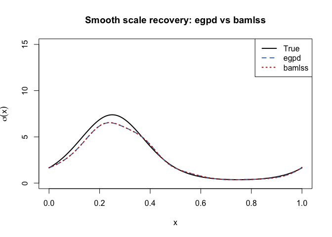

Comparing egpd and bamlss Fits
================

The `egpd` package provides bamlss family constructors (`egpd_bamlss()`,
`ziegpd_bamlss()`, `degpd_bamlss()`, and `zidegpd_bamlss()`) that allow
fitting continuous and discrete EGPD models (with optional
zero-inflation) using the `bamlss` package’s distributional regression
framework. This vignette compares parameter estimates from the two
fitting approaches on simulated data.

## Continuous EGPD Model 1

We simulate from a continuous EGPD with $G(u) = u^\kappa$ and fit using
both `egpd()` (penalised likelihood via GAM) and `bamlss()` (backfitting
with the `egpd_bamlss()` family).

``` r
library(egpd)
library(bamlss)
```

    Loading required package: coda

    Loading required package: colorspace

    Loading required package: distributions3


    Attaching package: 'distributions3'

    The following object is masked from 'package:stats':

        Gamma

    The following object is masked from 'package:grDevices':

        pdf

    Loading required package: mgcv

    Loading required package: nlme

    This is mgcv 1.9-3. For overview type 'help("mgcv-package")'.

    -

    For citation info, use citation("bamlss") and see http://www.bamlss.org/.


    Attaching package: 'bamlss'

    The following object is masked from 'package:mgcv':

        smooth.construct

``` r
set.seed(42)
sigma_true <- 2
xi_true    <- 0.2
kappa_true <- 1.5
n <- 2000

y <- regpd(n, sigma = sigma_true, xi = xi_true, kappa = kappa_true, type = 1)
df <- data.frame(y = y, x = rep(1, n))
```

### egpd fit

``` r
fit_egpd <- egpd(list(lpsi = y ~ 1, xi = ~ 1, lkappa = ~ 1),
                 data = df, family = "egpd", egpd.args = list(m = 1))
pars_egpd <- predict(fit_egpd, type = "response")[1, ]
```

### bamlss fit

``` r
fit_bamlss <- bamlss(list(y ~ 1, ~ 1, ~ 1),
                     data = df, family = egpd_bamlss(m = 1),
                     verbose = FALSE)
```

### Comparison

``` r
sigma_b <- exp(fit_bamlss$parameters$sigma$p)
xi_b    <- exp(fit_bamlss$parameters$xi$p)
kappa_b <- exp(fit_bamlss$parameters$kappa$p)

data.frame(
  parameter = c("sigma", "xi", "kappa"),
  true      = c(sigma_true, xi_true, kappa_true),
  egpd      = round(as.numeric(unlist(pars_egpd)), 4),
  bamlss    = round(c(sigma_b, xi_b, kappa_b), 4),
  row.names = NULL
)
```

      parameter true   egpd bamlss
    1     sigma  2.0 2.0957 2.0949
    2        xi  0.2 0.1933 0.1934
    3     kappa  1.5 1.3904 1.3907

Both approaches recover very similar parameter estimates.

## Continuous EGPD with smooth covariate

The real advantage of both frameworks is their ability to model
parameters as smooth functions of covariates. Here the scale varies with
a covariate.

``` r
set.seed(7)
n <- 2000
x <- runif(n, 0, 1)
sigma_x <- exp(0.5 + 1.5 * sin(2 * pi * x))
xi_true  <- 0.1
kappa_true <- 1.5

y <- regpd(n, sigma = sigma_x, xi = xi_true, kappa = kappa_true, type = 1)
df <- data.frame(y = y, x = x)
```

``` r
fit_egpd_s <- egpd(list(lpsi = y ~ s(x, k = 15), xi = ~ 1, lkappa = ~ 1),
                   data = df, family = "egpd", egpd.args = list(m = 1))
```

``` r
fit_bamlss_s <- bamlss(list(y ~ s(x, k = 15), ~ 1, ~ 1),
                       data = df, family = egpd_bamlss(m = 1),
                       verbose = FALSE)
```

Compare the recovered scale functions:

``` r
xgrid <- data.frame(x = seq(0, 1, length = 200))
pred_egpd <- predict(fit_egpd_s, newdata = xgrid, type = "response")

pred_bamlss <- predict(fit_bamlss_s, newdata = xgrid, type = "parameter")

plot(xgrid$x, exp(0.5 + 1.5 * sin(2 * pi * xgrid$x)), type = "l",
     lwd = 2, col = "black", ylim = c(0, 15),
     xlab = "x", ylab = expression(sigma(x)),
     main = "Smooth scale recovery: egpd vs bamlss")
lines(xgrid$x, pred_egpd$scale, col = "steelblue", lwd = 2, lty = 2)
lines(xgrid$x, pred_bamlss$sigma, col = "firebrick", lwd = 2, lty = 3)
legend("topright", legend = c("True", "egpd", "bamlss"),
       col = c("black", "steelblue", "firebrick"), lwd = 2, lty = 1:3)
```



## Zero-inflated continuous EGPD

The `ziegpd_bamlss()` family supports zero-inflated continuous EGPD
models, which are useful for data with excess zeros such as
precipitation.

``` r
set.seed(123)
sigma_true <- 2
xi_true    <- 0.2
kappa_true <- 1.5
pi_true    <- 0.3
n <- 2000

y <- rziegpd(n, pi = pi_true, sigma = sigma_true, xi = xi_true,
             kappa = kappa_true, type = 1)
df <- data.frame(y = y)
cat("Proportion of zeros:", mean(y == 0), "\n")
```

    Proportion of zeros: 0.296 

``` r
fit_zi <- bamlss(list(y ~ 1, ~ 1, ~ 1, ~ 1),
                 data = df, family = ziegpd_bamlss(m = 1),
                 verbose = FALSE)
```

``` r
sigma_zb <- exp(fit_zi$parameters$sigma$p)
xi_zb    <- exp(fit_zi$parameters$xi$p)
kappa_zb <- exp(fit_zi$parameters$kappa$p)
pi_zb    <- 1 / (1 + exp(-fit_zi$parameters$pi$p))

data.frame(
  parameter = c("sigma", "xi", "kappa", "pi"),
  true      = c(sigma_true, xi_true, kappa_true, pi_true),
  bamlss    = round(c(sigma_zb, xi_zb, kappa_zb, pi_zb), 4),
  row.names = NULL
)
```

      parameter true bamlss
    1     sigma  2.0 1.9946
    2        xi  0.2 0.2015
    3     kappa  1.5 1.4613
    4        pi  0.3 0.2960

The bamlss fit recovers all four parameters, including the
zero-inflation probability.

## Discrete EGPD (DEGPD) Model 1

The `degpd_bamlss()` family allows fitting discrete EGPD models via
bamlss. We compare `egpd()` (penalised likelihood) and `bamlss()` on
simulated count data.

``` r
set.seed(99)
sigma_true <- 3
xi_true    <- 0.15
kappa_true <- 2
n <- 2000

y <- rdiscegpd(n, sigma = sigma_true, xi = xi_true, kappa = kappa_true, type = 1)
df <- data.frame(y = y)
cat("Range of y:", range(y), "\n")
```

    Range of y: 0 147 

### egpd fit

``` r
fit_degpd <- egpd(list(lsigma = y ~ 1, lxi = ~ 1, lkappa = ~ 1),
                  data = df, family = "degpd", degpd.args = list(m = 1))
pars_degpd <- predict(fit_degpd, type = "response")[1, ]
```

### bamlss fit

``` r
fit_degpd_b <- bamlss(list(y ~ 1, ~ 1, ~ 1),
                      data = df, family = degpd_bamlss(m = 1),
                      verbose = FALSE)
```

### Comparison

``` r
sigma_db <- exp(fit_degpd_b$parameters$sigma$p)
xi_db    <- exp(fit_degpd_b$parameters$xi$p)
kappa_db <- exp(fit_degpd_b$parameters$kappa$p)

data.frame(
  parameter = c("sigma", "xi", "kappa"),
  true      = c(sigma_true, xi_true, kappa_true),
  egpd      = round(as.numeric(unlist(pars_degpd)), 4),
  bamlss    = round(c(sigma_db, xi_db, kappa_db), 4),
  row.names = NULL
)
```

      parameter true   egpd bamlss
    1     sigma 3.00 2.7332 2.7301
    2        xi 0.15 0.1974 0.1977
    3     kappa 2.00 2.1228 2.1248

Both approaches recover similar estimates for the discrete model.

## Zero-inflated discrete EGPD (ZIDEGPD) Model 1

The `zidegpd_bamlss()` family supports zero-inflated discrete EGPD
models.

``` r
set.seed(77)
sigma_true <- 3
xi_true    <- 0.15
kappa_true <- 2
pi_true    <- 0.25
n <- 2000

y <- rzidiscegpd(n, pi = pi_true, sigma = sigma_true, xi = xi_true,
                 kappa = kappa_true, type = 1)
df <- data.frame(y = y)
cat("Proportion of zeros:", mean(y == 0), "\n")
```

    Proportion of zeros: 0.292 

### egpd fit

``` r
fit_zidegpd <- egpd(list(lsigma = y ~ 1, lxi = ~ 1, lkappa = ~ 1, logitpi = ~ 1),
                    data = df, family = "zidegpd", zidegpd.args = list(m = 1))
pars_zidegpd <- predict(fit_zidegpd, type = "response")[1, ]
```

### bamlss fit

``` r
fit_zidegpd_b <- bamlss(list(y ~ 1, ~ 1, ~ 1, ~ 1),
                        data = df, family = zidegpd_bamlss(m = 1),
                        verbose = FALSE)
```

### Comparison

``` r
sigma_zdb <- exp(fit_zidegpd_b$parameters$sigma$p)
xi_zdb    <- exp(fit_zidegpd_b$parameters$xi$p)
kappa_zdb <- exp(fit_zidegpd_b$parameters$kappa$p)
pi_zdb    <- 1 / (1 + exp(-fit_zidegpd_b$parameters$pi$p))

data.frame(
  parameter = c("sigma", "xi", "kappa", "pi"),
  true      = c(sigma_true, xi_true, kappa_true, pi_true),
  egpd      = round(as.numeric(unlist(pars_zidegpd)), 4),
  bamlss    = round(c(sigma_zdb, xi_zdb, kappa_zdb, pi_zdb), 4),
  row.names = NULL
)
```

      parameter true   egpd bamlss
    1     sigma 3.00 3.0878 3.0733
    2        xi 0.15 0.1465 0.1479
    3     kappa 2.00 1.7892 1.8001
    4        pi 0.25 0.2161 0.2167

Both fitting approaches recover all four parameters for the
zero-inflated discrete model.
