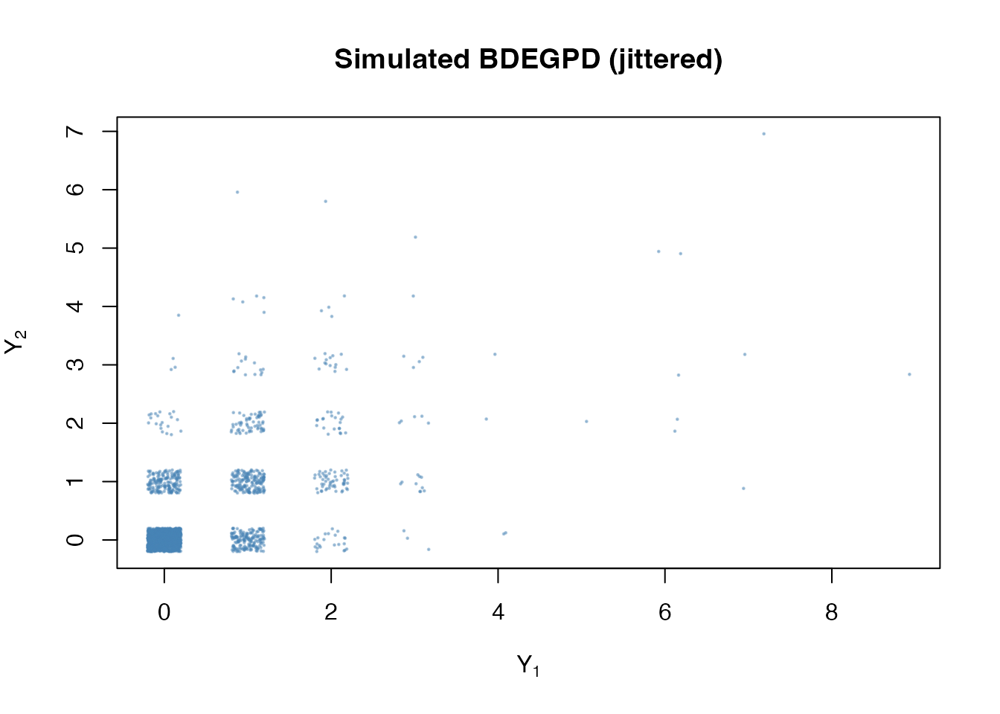
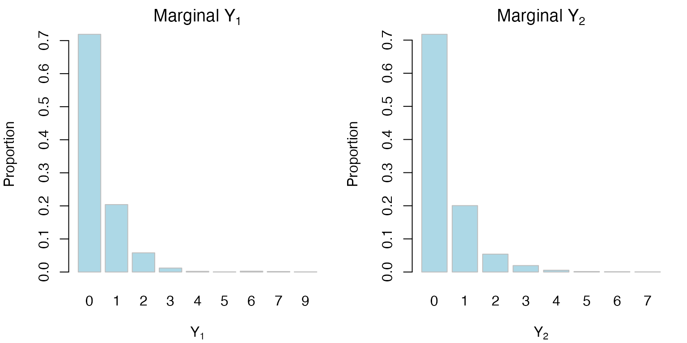
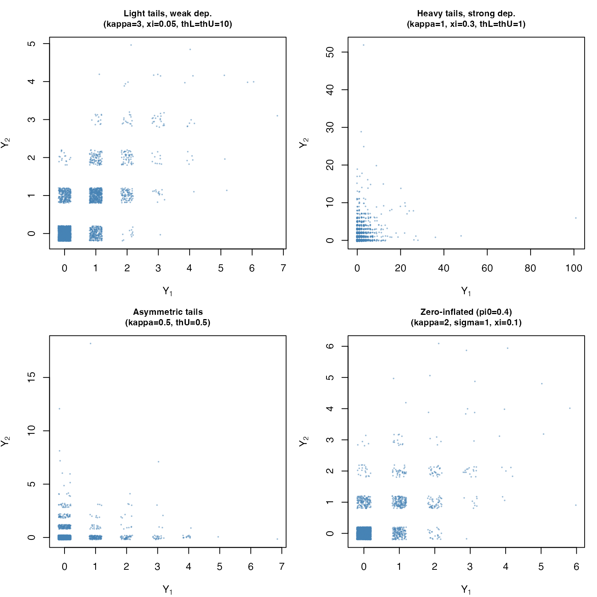
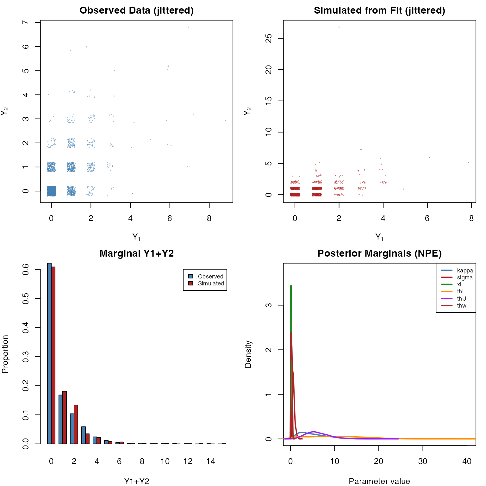
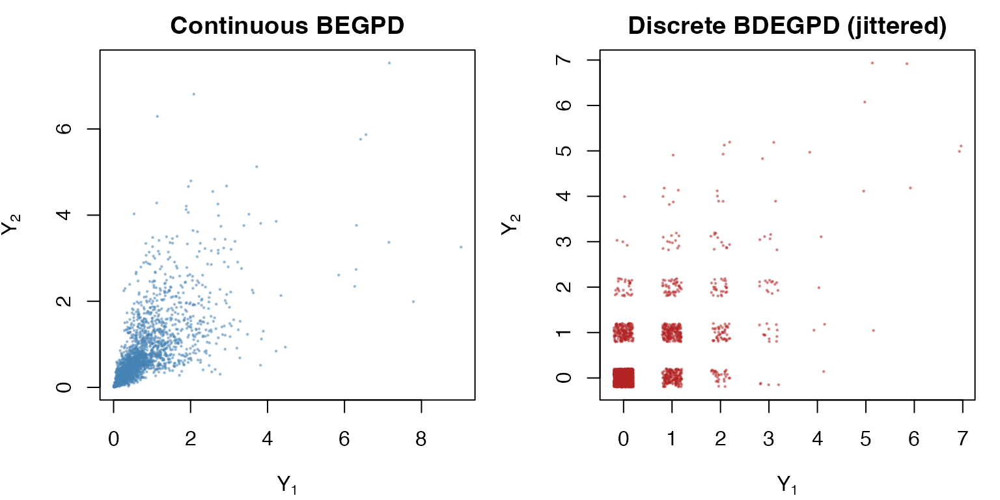

# Bivariate Discrete EGPD via Neural Bayes Estimation

The `egpd` package provides **experimental** bivariate discrete EGPD
(BDEGPD) and zero-inflated bivariate discrete EGPD (BZIDEGPD)
distributions, fitted via neural Bayes estimation. These extend the
continuous bivariate BEGPD of Alotaibi et al. (2025) to non-negative
integer data by applying [`floor()`](https://rdrr.io/r/base/Round.html)
to continuous samples.

This vignette covers:

1.  **The BDEGPD and BZIDEGPD models** – construction and parameters
2.  **Simulating bivariate discrete data** –
    [`rbdegpd()`](https://sdwfrost.github.io/egpd/reference/rbdegpd.md)
    and
    [`rbzidegpd()`](https://sdwfrost.github.io/egpd/reference/rbzidegpd.md)
3.  **Exploring the parameter space** – how parameters affect the
    discrete bivariate distribution
4.  **Neural Bayes estimation** – fitting via
    [`fitegpd()`](https://sdwfrost.github.io/egpd/reference/fitegpd.md)
5.  **Training custom models** –
    [`train_bdegpd()`](https://sdwfrost.github.io/egpd/reference/train_bdegpd.md)

## 1. The BDEGPD model

### Construction

The BDEGPD constructs bivariate non-negative integer observations by
discretizing the continuous BEGPD:

1.  Generate $`(Y_1^*, Y_2^*)`$ from the bivariate BEGPD (radial-angular
    construction with parameters $`\kappa`$, $`\sigma`$, $`\xi`$,
    $`\theta_L`$, $`\theta_U`$, $`\theta_\omega`$).
2.  Apply $`Y_j = \lfloor Y_j^* \rfloor`$ for $`j = 1, 2`$.

This parallels the univariate discrete EGPD, which uses
$`P(X = k) = F_{\mathrm{EGPD}}(k+1) - F_{\mathrm{EGPD}}(k)`$, but
extends to two dimensions via the BEGPD’s dependence structure.

### Zero-inflated extension (BZIDEGPD)

Many bivariate count datasets have excess joint zeros – for example,
paired event counts where both components are simultaneously inactive.
The BZIDEGPD adds a joint zero-inflation parameter $`\pi_0 \in (0, 1)`$:

``` math
(Y_1, Y_2) = \begin{cases}
(0, 0) & \text{with probability } \pi_0 \\
\lfloor\text{BEGPD}\rfloor & \text{with probability } 1 - \pi_0
\end{cases}
```

### Parameter summary

| Parameter | Symbol | Range | Role |
|----|----|----|----|
| `kappa` | $`\kappa`$ | $`(0, \infty)`$ | EGPD shape (controls bulk) |
| `sigma` | $`\sigma`$ | $`(0, \infty)`$ | GPD scale (intensity) |
| `xi` | $`\xi`$ | $`(0, \infty)`$ | GPD shape (tail heaviness) |
| `thL` | $`\theta_L`$ | $`(0, \infty)`$ | Lower tail dependence |
| `thU` | $`\theta_U`$ | $`(0, \infty)`$ | Upper tail dependence |
| `thw` | $`\theta_\omega`$ | $`(0, 0.5)`$ | Lower/upper mixing transition |
| `pi0` | $`\pi_0`$ | $`(0, 1)`$ | Joint zero-inflation (BZIDEGPD only) |

## 2. Simulating bivariate discrete data

The [`rbdegpd()`](https://sdwfrost.github.io/egpd/reference/rbdegpd.md)
and
[`rbzidegpd()`](https://sdwfrost.github.io/egpd/reference/rbzidegpd.md)
functions generate bivariate discrete samples. They are pure R and do
**not** require Julia.

### Basic BDEGPD

``` r

library(egpd)
set.seed(42)

Y <- rbdegpd(2000, kappa = 2, sigma = 1, xi = 0.1,
             thL = 5, thU = 5, thw = 0.2)
head(Y)
#>      Y1 Y2
#> [1,]  1  2
#> [2,]  2  1
#> [3,]  0  0
#> [4,]  1  1
#> [5,]  1  0
#> [6,]  0  0
cat("Dimensions:", nrow(Y), "x", ncol(Y), "\n")
#> Dimensions: 2000 x 2
cat("Storage mode:", storage.mode(Y), "\n")
#> Storage mode: integer
cat("Range Y1:", range(Y[, 1]), "  Range Y2:", range(Y[, 2]), "\n")
#> Range Y1: 0 9   Range Y2: 0 7
```

Since the data are integers, scatter plots benefit from jittering to
avoid overplotting on the grid:

``` r

plot(jitter(Y[, 1]), jitter(Y[, 2]), pch = 20, cex = 0.3,
     xlab = expression(Y[1]), ylab = expression(Y[2]),
     main = "Simulated BDEGPD (jittered)",
     col = adjustcolor("steelblue", 0.4))
```



### Marginal distributions

The marginal distributions of a BDEGPD are univariate discrete EGPD
(DEGPD):

``` r

op <- par(mfrow = c(1, 2), mar = c(4, 4, 2, 1))

barplot(table(Y[, 1]) / nrow(Y), main = expression("Marginal " * Y[1]),
        xlab = expression(Y[1]), ylab = "Proportion",
        col = "lightblue", border = "grey")

barplot(table(Y[, 2]) / nrow(Y), main = expression("Marginal " * Y[2]),
        xlab = expression(Y[2]), ylab = "Proportion",
        col = "lightblue", border = "grey")
```



``` r

par(op)
```

### Zero-inflated BZIDEGPD

``` r

set.seed(42)
Y_zi <- rbzidegpd(2000, kappa = 2, sigma = 1, xi = 0.1,
                   thL = 5, thU = 5, thw = 0.2, pi0 = 0.3)

joint_zeros <- mean(Y_zi[, 1] == 0 & Y_zi[, 2] == 0)
cat("Proportion of joint (0,0) rows:", round(joint_zeros, 3), "\n")
#> Proportion of joint (0,0) rows: 0.725
cat("(Expected >= pi0 = 0.3 due to natural zeros)\n")
#> (Expected >= pi0 = 0.3 due to natural zeros)
```

## 3. Exploring the parameter space

The six BDEGPD parameters control different aspects of the bivariate
discrete distribution.

``` r

set.seed(123)
n <- 3000

scenarios <- list(
  "Light tails, weak dep.\n(kappa=3, xi=0.05, thL=thU=10)" = list(
    kappa = 3, sigma = 1, xi = 0.05, thL = 10, thU = 10, thw = 0.25
  ),
  "Heavy tails, strong dep.\n(kappa=1, xi=0.3, thL=thU=1)" = list(
    kappa = 1, sigma = 2, xi = 0.3, thL = 1, thU = 1, thw = 0.25
  ),
  "Asymmetric tails\n(kappa=0.5, thU=0.5)" = list(
    kappa = 0.5, sigma = 1, xi = 0.1, thL = 10, thU = 0.5, thw = 0.25
  ),
  "Zero-inflated (pi0=0.4)\n(kappa=2, sigma=1, xi=0.1)" = list(
    kappa = 2, sigma = 1, xi = 0.1, thL = 5, thU = 5, thw = 0.2, pi0 = 0.4
  )
)

op <- par(mfrow = c(2, 2), mar = c(4, 4, 3, 1))
for (i in seq_along(scenarios)) {
  sc <- scenarios[[i]]
  if (!is.null(sc$pi0)) {
    Y_sc <- rbzidegpd(n, kappa = sc$kappa, sigma = sc$sigma, xi = sc$xi,
                       thL = sc$thL, thU = sc$thU, thw = sc$thw, pi0 = sc$pi0)
  } else {
    Y_sc <- rbdegpd(n, kappa = sc$kappa, sigma = sc$sigma, xi = sc$xi,
                     thL = sc$thL, thU = sc$thU, thw = sc$thw)
  }
  plot(jitter(Y_sc[, 1]), jitter(Y_sc[, 2]), pch = 20, cex = 0.3,
       main = names(scenarios)[i], cex.main = 0.85,
       xlab = expression(Y[1]), ylab = expression(Y[2]),
       col = adjustcolor("steelblue", 0.4))
}
```



``` r

par(op)
```

**Key observations:**

- **Light tails + weak dependence** ($`\theta_L = \theta_U = 10`$): Most
  mass near zero, observations are roughly independent.
- **Heavy tails + strong dependence** ($`\theta_L = \theta_U = 1`$):
  Larger values, strong clustering along the diagonal.
- **Asymmetric tails** ($`\theta_U = 0.5`$): Upper tail exhibits strong
  dependence (both components tend to be simultaneously large).
- **Zero-inflation** ($`\pi_0 = 0.4`$): Prominent spike at $`(0, 0)`$
  beyond what the base model produces.

## 4. Dependence structure

The BDEGPD inherits the dependence structure of the continuous BEGPD,
discretized to the integer lattice. We can visualise how the correlation
and joint zero probability vary with parameters:

``` r

set.seed(1)
n_dep <- 5000

## Vary thL = thU jointly (dependence strength)
th_vals <- c(0.5, 1, 2, 5, 10, 20)
cors <- sapply(th_vals, function(th) {
  Y_tmp <- rbdegpd(n_dep, kappa = 2, sigma = 1, xi = 0.1,
                    thL = th, thU = th, thw = 0.25)
  cor(Y_tmp[, 1], Y_tmp[, 2])
})

op <- par(mfrow = c(1, 2), mar = c(4, 4, 2, 1))

plot(th_vals, cors, type = "b", pch = 16,
     xlab = expression(theta[L] == theta[U]),
     ylab = "Correlation",
     main = "Pearson correlation vs dependence")
abline(h = 0, col = "grey", lty = 2)

## Vary xi (tail heaviness affects joint structure)
xi_vals <- c(0.01, 0.05, 0.1, 0.2, 0.3, 0.5)
cors_xi <- sapply(xi_vals, function(xi_v) {
  Y_tmp <- rbdegpd(n_dep, kappa = 2, sigma = 1, xi = xi_v,
                    thL = 3, thU = 3, thw = 0.25)
  cor(Y_tmp[, 1], Y_tmp[, 2])
})

plot(xi_vals, cors_xi, type = "b", pch = 16,
     xlab = expression(xi),
     ylab = "Correlation",
     main = expression("Correlation vs " * xi * " (thL=thU=3)"))
```


``` r

par(op)
```

## 5. Neural Bayes estimation

### Why neural estimation?

The BDEGPD has no closed-form bivariate discrete likelihood. The
discretization `floor(BEGPD)` breaks the analytical structure of the
continuous model: computing the joint PMF $`P(Y_1 = k_1, Y_2 = k_2)`$
would require integrating the bivariate density over a unit square,
which is intractable for six parameters.

Neural Bayes estimation sidesteps the likelihood by training a neural
network on simulated data. Once trained, inference on new datasets is
nearly instant.

### Prerequisites

Neural Bayes estimation requires Julia (\>= 1.11):

``` r

# R packages
install.packages("JuliaConnectoR")
remotes::install_github("msainsburydale/NeuralEstimators")

# Julia packages (run in Julia REPL)
# using Pkg
# Pkg.add(["NeuralEstimators", "Flux"])
```

### Fitting BDEGPD with NPE

``` r

set.seed(42)

Y <- rbdegpd(2000, kappa = 2, sigma = 1, xi = 0.1,
             thL = 5, thU = 5, thw = 0.2)

fit <- fitegpd(Y, family = "bdegpd", method = "neuralbayes",
               estimator = "npe", nsamples = 2000)
#> Starting Julia ...
summary(fit)
#> Fitting of bivariate discrete EGPD (BDEGPD) [Experimental]
#> Method: neuralbayes (npe)  [2000 posterior samples]
#> 
#> Posterior summary:
#>        Median Post.SD   2.5%   97.5%
#> kappa  4.4929  3.1151 0.9939 12.3908
#> sigma  0.6330  0.2939 0.2654  1.4040
#> xi     0.1629  0.1128 0.0166  0.4279
#> thL   10.0429  6.3580 0.5709 23.1020
#> thU    5.8545  2.8684 1.9730 13.1217
#> thw    0.2309  0.1377 0.0245  0.5024
#> 
#> Note: log-likelihood, AIC, and BIC are not available for neural estimation
#> Number of observations:  2000
```

The summary reports posterior medians, posterior standard deviations,
and 95% credible intervals for all six parameters.

### Fitting BZIDEGPD with NPE

``` r

set.seed(42)

Y_zi <- rbzidegpd(2000, kappa = 2, sigma = 1, xi = 0.1,
                   thL = 5, thU = 5, thw = 0.2, pi0 = 0.3)

fit_zi <- fitegpd(Y_zi, family = "bzidegpd", method = "neuralbayes",
                   estimator = "npe", nsamples = 2000)
summary(fit_zi)
#> Fitting of zero-inflated bivariate discrete EGPD (BZIDEGPD) [Experimental]
#> Method: neuralbayes (npe)  [2000 posterior samples]
#> 
#> Posterior summary:
#>       Median Post.SD   2.5%   97.5%
#> kappa 4.3215  3.2761 0.8761 13.0502
#> sigma 0.7046  0.3256 0.2804  1.4882
#> xi    0.1604  0.1103 0.0127  0.3971
#> thL   8.8578  5.7294 0.7478 21.4948
#> thU   5.1771  3.4908 0.8581 14.1159
#> thw   0.2558  0.1429 0.0290  0.5420
#> pi0   0.2724  0.2055 0.0087  0.6872
#> 
#> Note: log-likelihood, AIC, and BIC are not available for neural estimation
#> Number of observations:  2000
```

The BZIDEGPD fit estimates seven parameters (the six BDEGPD parameters
plus $`\pi_0`$).

### Diagnostic plots

``` r

plot(fit)
```



The diagnostic plot for BDEGPD/BZIDEGPD shows four panels:

1.  **Observed scatter** (jittered) – the integer-valued input data
2.  **Simulated scatter** (jittered) – data from the fitted model
3.  **Marginal barplot** – observed vs simulated distribution of
    $`Y_1 + Y_2`$
4.  **Posterior marginals** (NPE) or **parameter bar chart** (NBE)

### S3 methods

All standard S3 methods work for BDEGPD fits:

``` r

coef(fit)                # Posterior median estimates
#>      kappa      sigma         xi        thL        thU        thw 
#>  4.4928845  0.6330015  0.1628595 10.0428603  5.8544827  0.2309155
confint(fit)             # 95% credible intervals
#>            2.5 %     97.5 %
#> kappa 0.99389462 12.3907538
#> sigma 0.26536305  1.4040061
#> xi    0.01660769  0.4278888
#> thL   0.57088922 23.1019973
#> thU   1.97297296 13.1216692
#> thw   0.02453829  0.5024474
confint(fit, level = 0.9) # 90% credible intervals
#>              5 %       95 %
#> kappa 1.25211543 11.1133906
#> sigma 0.29931825  1.2648777
#> xi    0.02604579  0.3832131
#> thL   1.06572944 21.2153999
#> thU   2.45191137 11.7026999
#> thw   0.03691453  0.4698184
vcov(fit)                # Posterior covariance matrix
#>             kappa         sigma            xi         thL         thU
#> kappa  9.70354669 -0.7342482901  0.1827664998  0.45042036  1.38813252
#> sigma -0.73424829  0.0863741629 -0.0234915696  0.01452720 -0.09187063
#> xi     0.18276650 -0.0234915696  0.0127243260 -0.03512248 -0.02389033
#> thL    0.45042036  0.0145272021 -0.0351224829 40.42441686 -2.10625723
#> thU    1.38813252 -0.0918706289 -0.0238903321 -2.10625723  8.22761354
#> thw    0.01395369 -0.0009261211  0.0005739534  0.11202078  0.03024729
#>                 thw
#> kappa  0.0139536868
#> sigma -0.0009261211
#> xi     0.0005739534
#> thL    0.1120207780
#> thU    0.0302472858
#> thw    0.0189747138
nobs(fit)                # Number of observations
#> [1] 2000
```

Since neural estimation bypasses the likelihood,
[`logLik()`](https://rdrr.io/r/stats/logLik.html),
[`AIC()`](https://rdrr.io/r/stats/AIC.html), and
[`BIC()`](https://rdrr.io/r/stats/AIC.html) return `NA`.

## 6. Comparison with BEGPD

One natural question is how the discrete BDEGPD compares with the
continuous BEGPD. The key differences are:

| Aspect | BEGPD | BDEGPD |
|----|----|----|
| Support | $`[0, \infty)^2`$ | $`\{0, 1, 2, \ldots\}^2`$ |
| Construction | Continuous radial-angular | `floor(BEGPD)` |
| Parameters | 6 ($`\kappa, \sigma, \xi, \theta_L, \theta_U, \theta_\omega`$) | Same 6 |
| Likelihood | No closed form | No closed form |
| Estimation | Neural Bayes | Neural Bayes |
| Typical data | Rainfall intensities, financial returns | Event counts, insurance claims |

The discretization preserves the dependence structure in the upper tail
(large counts remain correlated) but introduces point masses at small
values.

``` r

set.seed(42)
n_compare <- 2000

Y_cont <- rbegpd(n_compare, kappa = 2, sigma = 1, xi = 0.1,
                  thL = 5, thU = 5, thw = 0.2)
Y_disc <- rbdegpd(n_compare, kappa = 2, sigma = 1, xi = 0.1,
                   thL = 5, thU = 5, thw = 0.2)

op <- par(mfrow = c(1, 2), mar = c(4, 4, 2, 1))
plot(Y_cont[, 1], Y_cont[, 2], pch = 20, cex = 0.3,
     main = "Continuous BEGPD",
     xlab = expression(Y[1]), ylab = expression(Y[2]),
     col = adjustcolor("steelblue", 0.4))
plot(jitter(Y_disc[, 1]), jitter(Y_disc[, 2]), pch = 20, cex = 0.3,
     main = "Discrete BDEGPD (jittered)",
     xlab = expression(Y[1]), ylab = expression(Y[2]),
     col = adjustcolor("firebrick", 0.4))
```



``` r

par(op)
```

## 7. Training custom models

The bundled `.bson` models were trained on broad uniform priors. For
specific applications you may want to train on a narrower prior.

``` r

# Quick training (for testing)
paths <- train_bdegpd(
  savepath = tempdir(),
  family = "bdegpd",
  estimator = "both",
  quick = TRUE,
  verbose = TRUE
)

# Use the custom-trained model
fit_custom <- fitegpd(Y, family = "bdegpd", method = "neuralbayes",
                      model.path = paths$npe, estimator = "npe")

# Train BZIDEGPD model
paths_zi <- train_bdegpd(
  savepath = tempdir(),
  family = "bzidegpd",
  estimator = "npe",
  quick = TRUE
)
```

### Training hyperparameters

| Parameter         | Quick mode | Full mode | Description             |
|-------------------|------------|-----------|-------------------------|
| `K`               | 20,000     | 100,000   | Training parameter sets |
| `m`               | 500:1000   | 1000:4000 | Sample size range       |
| `epochs`          | 10         | 100       | Maximum training epochs |
| `stopping_epochs` | 10         | 10        | Early stopping patience |

## References

Alotaibi, N., Sainsbury-Dale, M., Naveau, P., Gaetan, C., and Huser, R.
(2025). Joint modeling of low and high extremes using a multivariate
extended generalized Pareto distribution. *arXiv preprint*
arXiv:2509.05982. <https://arxiv.org/abs/2509.05982>

Sainsbury-Dale, M., Zammit-Mangion, A., and Huser, R. (2024).
Likelihood-free parameter estimation with neural Bayes estimators. *The
American Statistician*, 78(1), 1–14.

Naveau, P., Huser, R., Ribereau, P., and Hannart, A. (2016). Modeling
jointly low, moderate, and heavy rainfall intensities without a
threshold selection. *Water Resources Research*, 52(4), 2897–2911.
