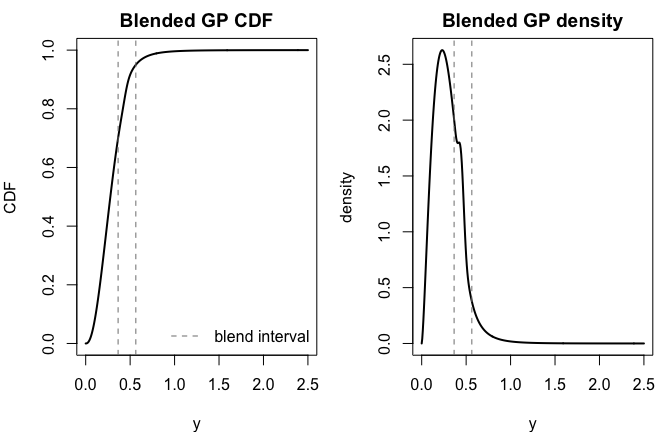

Blended Generalized Pareto Distributions
================

The blended generalized Pareto (bGP) distribution implemented in `egpd`
follows the construction of Majumder and Richards (2026),
[*Semi-parametric bulk and tail regression using spline-based neural
networks*](https://doi.org/10.1007/s10687-026-00533-y). The paper
proposes a smooth all-in-one distribution that:

1.  uses a flexible finite-support model for the bulk;
2.  transitions smoothly across a blending interval; and
3.  recovers an **exact** generalized Pareto (GP) upper tail.

The current `egpd` interface exposes this as unconditional distribution
utilities:

- `pbgpd()` for the CDF,
- `dbgpd()` for the density,
- `qbgpd()` for quantiles,
- `rbgpd()` for simulation.

Rather than forcing the bGP into a single parametric `fitegpd()` family,
the package treats it as a generic bulk-plus-tail construction: you
supply a bulk CDF/density/quantile triple on `[0, 1]`, and `egpd`
handles the blend and the derived GP bridge automatically.

## 1. The paper’s construction

Let `F`, `f`, and `Q` denote the bulk CDF, density, and quantile
function on `[0, 1]`. Choose two bulk probabilities `pa < pb`, and
define the blending interval

$$a = Q(pa), \qquad b = Q(pb).$$

The paper uses a Beta-CDF weighting function

$$w(y) = F_{\mathrm{Beta}}\!\left(\frac{y-a}{b-a}; c_1, c_2\right),$$

which smoothly increases from `0` to `1` over `[a, b]`. In package
terms, the resulting blended CDF is evaluated as

$$H(y)=
\begin{cases}
F(y), & y \le a, \\
\exp\{(1-w(y))\log F(y) + w(y)\log F_{\mathrm{GP}}(y)\}, & a < y < b, \\
F_{\mathrm{GP}}(y), & y \ge b,
\end{cases}$$

where the GP threshold and scale are chosen so that the bulk and GP
distributions agree at both `a` and `b`. This yields the exact GP upper
tail from the paper, while keeping the body flexible.

The implementation also checks the blended density numerically on
`[a, b]`. This matters because the paper notes that some bulk/weight
combinations can, in principle, create invalid negative densities in the
blending interval.

## 2. A default Beta-bulk example

The simplest way to use the bGP helpers is with the default Beta bulk.
Here we choose a moderately heavy upper tail (`xi = 0.2`) and let the
blend run from the 70th to the 95th bulk percentile.

``` r
library(egpd)

args <- list(
  xi = 0.2,
  bulk.args = list(shape1 = 2.5, shape2 = 6),
  pa = 0.7,
  pb = 0.95,
  c1 = 5,
  c2 = 6
)

a <- do.call(qbeta, c(list(p = args$pa), args$bulk.args))
b <- do.call(qbeta, c(list(p = args$pb), args$bulk.args))

round(c(a = a, b = b), 3)
```

        a     b 
    0.364 0.564 

``` r
grid <- seq(0, 2.5, length.out = 400)
cdf_vals <- do.call(pbgpd, c(list(q = grid), args))
dens_vals <- do.call(dbgpd, c(list(x = grid), args))

op <- par(mfrow = c(1, 2), mar = c(4, 4, 2, 1))
plot(grid, cdf_vals, type = "l", lwd = 2,
     xlab = "y", ylab = "CDF", main = "Blended GP CDF")
abline(v = c(a, b), lty = 2, col = "grey50")
legend("bottomright", legend = c("blend interval"), lty = 2, col = "grey50", bty = "n")

plot(grid, dens_vals, type = "l", lwd = 2,
     xlab = "y", ylab = "density", main = "Blended GP density")
abline(v = c(a, b), lty = 2, col = "grey50")
```



``` r
par(op)
```

The vertical lines mark the blending interval. To the left of `a`, the
model is exactly the bulk distribution; to the right of `b`, it is
exactly GP.

``` r
round(
  do.call(qbgpd, c(list(p = c(0.5, 0.9, 0.99, 0.999)), args)),
  3
)
```

    [1] 0.277 0.483 0.816 1.351

Because `rbgpd()` is defined through the quantile function, simulation
is straightforward:

``` r
set.seed(1)
y <- do.call(rbgpd, c(list(n = 400), args))

summary(y)
```

       Min. 1st Qu.  Median    Mean 3rd Qu.    Max. 
    0.04534 0.18406 0.26724 0.29454 0.37796 1.00405 

## 3. Supplying a custom bulk distribution

The bGP helper functions are generic in the bulk. To illustrate that, we
can swap the Beta body for a Kumaraswamy distribution on `[0, 1]`.

``` r
pkumar <- function(q, a, b) {
  out <- 1 - (1 - q^a)^b
  out[q <= 0] <- 0
  out[q >= 1] <- 1
  out
}

dkumar <- function(x, a, b) {
  out <- a * b * x^(a - 1) * (1 - x^a)^(b - 1)
  out[x < 0 | x > 1] <- 0
  out
}

qkumar <- function(p, a, b) {
  (1 - (1 - p)^(1 / b))^(1 / a)
}

args_kumar <- list(
  xi = 0.15,
  pbulk = pkumar,
  dbulk = dkumar,
  qbulk = qkumar,
  bulk.args = list(a = 1.8, b = 4.5),
  pa = 0.75,
  pb = 0.95,
  c1 = 5,
  c2 = 5
)

round(
  do.call(qbgpd, c(list(p = c(0.5, 0.9, 0.99)), args_kumar)),
  3
)
```

    [1] 0.339 0.589 0.914

This is the main reason the package exposes the bGP as standalone
`p/d/q/r` helpers: the paper’s construction is a **family of blends**,
not a single bulk parameterization.

## 4. Checking the exact GP tail

For `y >= b`, the package should agree exactly with the bridged GP tail
implied by the paper. We can reconstruct the bridge parameters and
compare directly.

``` r
A <- (1 - args$pa)^(-args$xi)
B <- (1 - args$pb)^(-args$xi)
sigma_bridge <- args$xi * (a - b) / (A - B)
u_bridge <- a - sigma_bridge * (A - 1) / args$xi

tail_x <- c(b + 0.1, b + 0.4, b + 0.8)

tail_compare <- data.frame(
  x = round(tail_x, 3),
  pbgpd = round(do.call(pbgpd, c(list(q = tail_x), args)), 6),
  gp_cdf = round(1 - (1 + args$xi * (tail_x - u_bridge) / sigma_bridge)^(-1 / args$xi), 6),
  dbgpd = round(do.call(dbgpd, c(list(x = tail_x), args)), 6),
  gp_density = round((1 / sigma_bridge) *
    (1 + args$xi * (tail_x - u_bridge) / sigma_bridge)^(-1 / args$xi - 1), 6)
)

tail_compare
```

          x    pbgpd   gp_cdf    dbgpd gp_density
    1 0.664 0.975234 0.975234 0.162323   0.162323
    2 0.964 0.995283 0.995283 0.022191   0.022191
    3 1.364 0.999045 0.999045 0.003265   0.003265

The bGP and GP columns agree, confirming that the package implementation
really does recover the exact GP tail after the blending interval.

## 5. Bounded tails when `xi < 0`

The same helpers also work for bounded upper tails. When `xi < 0`, the
blended distribution has a finite upper endpoint, exactly as a GP does.

``` r
args_neg <- list(
  xi = -0.2,
  bulk.args = list(shape1 = 3, shape2 = 7),
  pa = 0.75,
  pb = 0.95,
  c1 = 5,
  c2 = 5
)

endpoint <- do.call(qbgpd, c(list(p = 1), args_neg))

data.frame(
  endpoint = endpoint,
  cdf_at_endpoint = do.call(pbgpd, c(list(q = endpoint), args_neg))
)
```

      endpoint cdf_at_endpoint
    1 0.968625               1

This makes the bGP useful both for heavy-tailed settings (`xi > 0`) and
for bounded-response settings where the upper tail should terminate
naturally.

## 6. Current package scope

The present `egpd` implementation focuses on the unconditional bGP
distribution layer from the paper:

1.  the bulk model must currently live on `[0, 1]`;
2.  the blend is available through `pbgpd()`, `dbgpd()`, `qbgpd()`, and
    `rbgpd()`;
3.  the functions stop early when the chosen blend appears numerically
    invalid.

This keeps the package close to the paper’s mathematical construction
while leaving room for higher-level regression wrappers later.
