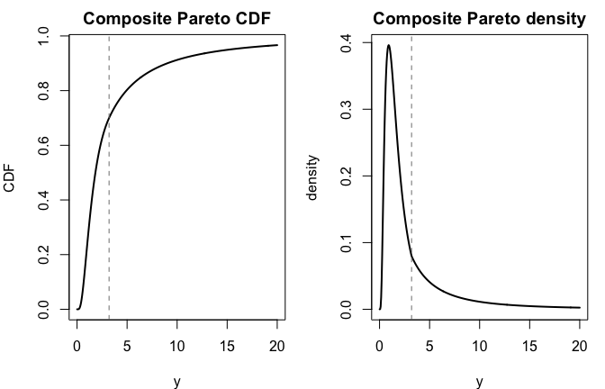
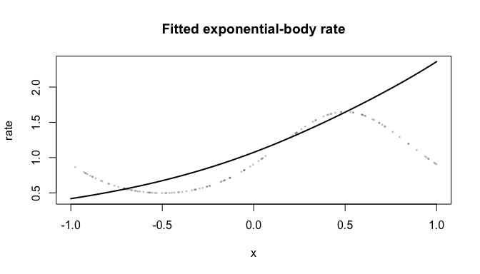

Composite Pareto Distributions and GAMs
================

The `egpd` package includes continuous composite Pareto distribution
helpers and a `family = "comppareto"` option for `egpd()`. This follows
the composite construction used in the CRAN package
[`CompPareto`](https://CRAN.R-project.org/package=CompPareto), where a
continuous body distribution is joined to a Pareto tail at a positive
splice point `theta`.

The current `egpd` implementation covers two related tasks:

1.  unconditional `d/p/q/rcomppareto()` utilities for continuous
    composite Pareto distributions;
2.  additive CompPareto regression through the existing `egpd()` GAM
    framework.

## 1. The composite Pareto construction

Let `G1` and `g1` denote the body CDF and density. In the current
package version, the body can be one of:

- `"lnorm"`
- `"gamma"`
- `"weibull"`
- `"exp"`

Above the splice point `theta`, the model uses a Pareto tail with shape
parameter `alpha`. The weight is chosen so that the density is
continuous at the splice point. In practice, this gives a model that
behaves like the chosen body below `theta` and like a heavy-tailed
Pareto model above `theta`.

## 2. Standalone distribution utilities

We start with a lognormal body. The standalone helpers use the same
parameterization as the body distribution plus the Pareto tail
parameters `alpha` and `theta`.

``` r
library(egpd)

args <- list(
  spec = "lnorm",
  meanlog = 0.4,
  sdlog = 0.7,
  alpha = 1.7,
  theta = 3.2
)

probs <- c(0.5, 0.9, 0.99)
qvals <- do.call(qcomppareto, c(list(p = probs), args))

data.frame(
  prob = probs,
  quantile = round(qvals, 3),
  cdf_back = round(do.call(pcomppareto, c(list(q = qvals), args)), 6)
)
```

      prob quantile cdf_back
    1 0.50    1.834     0.50
    2 0.90    9.021     0.90
    3 0.99   44.153     0.99

The returned probabilities agree with the inputs, showing the usual
`p(q(p)) = p` roundtrip.

``` r
grid <- seq(0.01, 20, length.out = 400)
cdf_vals <- do.call(pcomppareto, c(list(q = grid), args))
dens_vals <- do.call(dcomppareto, c(list(x = grid), args))

op <- par(mfrow = c(1, 2), mar = c(4, 4, 2, 1))
plot(grid, cdf_vals, type = "l", lwd = 2,
     xlab = "y", ylab = "CDF", main = "Composite Pareto CDF")
abline(v = args$theta, lty = 2, col = "grey50")

plot(grid, dens_vals, type = "l", lwd = 2,
     xlab = "y", ylab = "density", main = "Composite Pareto density")
abline(v = args$theta, lty = 2, col = "grey50")
```



``` r
par(op)
```

The dashed line marks the splice point `theta`.

We can also inspect the density numerically just below and just above
the splice point.

``` r
eps <- 1e-6

data.frame(
  x = c(args$theta - eps, args$theta, args$theta + eps),
  density = do.call(
    dcomppareto,
    c(list(x = c(args$theta - eps, args$theta, args$theta + eps)), args)
  )
)
```

             x    density
    1 3.199999 0.07977388
    2 3.200000 0.07977382
    3 3.200001 0.07977378

The values are nearly identical, reflecting the continuity built into
the construction.

## 3. Supported body specifications

The unconditional helpers and the GAM family share the same `spec`
choices. The main difference is the naming convention for the regression
formulas.

``` r
data.frame(
  spec = c("lnorm", "gamma", "weibull", "exp"),
  standalone_parameters = c(
    "meanlog, sdlog, alpha, theta",
    "shape, scale, alpha, theta",
    "shape, scale, alpha, theta",
    "rate, alpha, theta"
  ),
  gam_formula_names = c(
    "meanlog, logsdlog, logalpha, logtheta",
    "logshape, logscale, logalpha, logtheta",
    "logshape, logscale, logalpha, logtheta",
    "lograte, logalpha, logtheta"
  )
)
```

         spec        standalone_parameters                      gam_formula_names
    1   lnorm meanlog, sdlog, alpha, theta  meanlog, logsdlog, logalpha, logtheta
    2   gamma   shape, scale, alpha, theta logshape, logscale, logalpha, logtheta
    3 weibull   shape, scale, alpha, theta logshape, logscale, logalpha, logtheta
    4     exp           rate, alpha, theta            lograte, logalpha, logtheta

The exponential-body case is especially convenient for regression
examples because it only needs three parameter formulas.

## 4. Fitting a CompPareto GAM

Here we simulate data from an exponential-body composite Pareto model
with a smooth predictor effect on the body rate.

``` r
set.seed(22)

n <- 120
x <- sort(stats::runif(n, -1, 1))
rate <- exp(-0.1 + 0.6 * sin(pi * x))
y <- vapply(
  seq_len(n),
  function(i) rcomppareto(1, spec = "exp", rate = rate[i], alpha = 1.3, theta = 1.5),
  numeric(1)
)

dat <- data.frame(y = y, x = x)
```

We then fit the composite Pareto GAM by selecting
`family = "comppareto"` and passing the body specification through
`comppareto.args`.

``` r
fit <- suppressMessages(
  egpd(
    list(lograte = y ~ s(x, k = 5), logalpha = ~1, logtheta = ~1),
    data = dat,
    family = "comppareto",
    comppareto.args = list(spec = "exp")
  )
)

fit$convergence
```

    [1] 0

The fitted response-scale parameters can be predicted in the usual way.

``` r
pred_grid <- data.frame(x = seq(-1, 1, length.out = 100))
pars_hat <- predict(fit, newdata = pred_grid, type = "response")

head(round(pars_hat, 3))
```

       rate alpha theta
    1 0.418 1.031  0.89
    2 0.426 1.031  0.89
    3 0.434 1.031  0.89
    4 0.442 1.031  0.89
    5 0.451 1.031  0.89
    6 0.460 1.031  0.89

``` r
plot(pred_grid$x, pars_hat$rate, type = "l", lwd = 2,
     xlab = "x", ylab = "rate", main = "Fitted exponential-body rate")
points(x, rate, pch = 16, cex = 0.4, col = grDevices::adjustcolor("black", alpha.f = 0.25))
```



Quantile prediction also works through the regular `predict.egpd()`
interface.

``` r
round(
  predict(
    fit,
    newdata = data.frame(x = c(-0.75, 0, 0.75)),
    type = "quantile",
    prob = c(0.5, 0.9, 0.99)
  ),
  3
)
```

      q:0.5 q:0.9 q:0.99
    1 1.245 9.287 94.156
    2 1.245 9.287 94.156
    3 1.245 9.287 94.156

Randomized quantile residuals are available as well.

``` r
summary(rqresid(fit, seed = 1))
```

        Min.  1st Qu.   Median     Mean  3rd Qu.     Max. 
    -2.39004 -0.61597 -0.05425  0.02381  0.61878  2.40466 

## 5. Intercept-only four-parameter fits

The same interface also supports four-parameter bodies such as the
lognormal. In that case, the formula list simply includes an extra body
parameter:

``` r
fit_lnorm <- egpd(
  list(meanlog = y ~ 1, logsdlog = ~1, logalpha = ~1, logtheta = ~1),
  data = data.frame(y = y),
  family = "comppareto",
  comppareto.args = list(spec = "lnorm")
)
```

This is often the simplest way to start when you want to compare
different body specifications before adding predictor effects.

## 6. Current scope

The present CompPareto implementation in `egpd` is intentionally
focused:

1.  only the continuous body specifications `"lnorm"`, `"gamma"`,
    `"weibull"`, and `"exp"` are currently exposed;
2.  the GAM family uses numerical derivatives on the linear predictor
    scale, so it is usually slower than the native EGPD likelihoods;
3.  randomized quantile residuals and quantile prediction are supported
    for the new family;
4.  discrete composite Pareto helpers from the upstream `CompPareto`
    package are not yet part of the `egpd()` GAM layer.

That makes the current implementation a good fit for continuous
bulk-plus-tail modeling, while leaving room for broader
composite-distribution extensions later.
