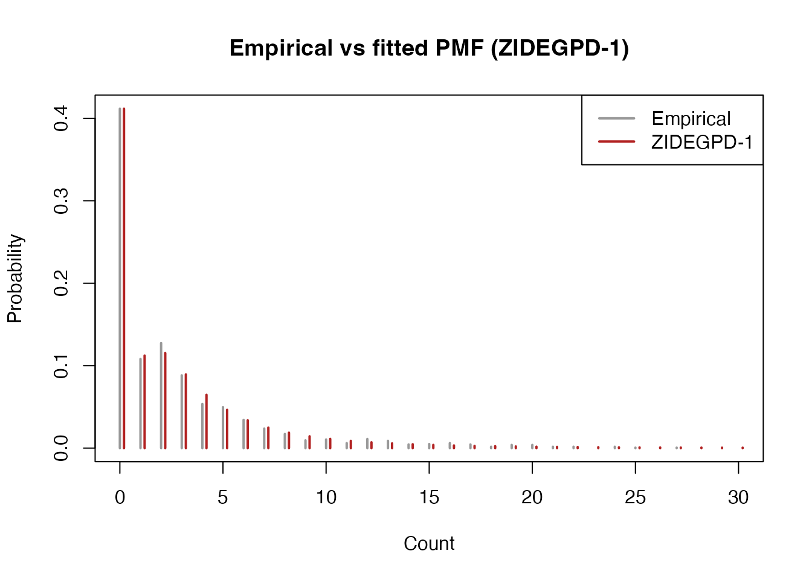

# Zero-Inflated Discrete EGPD Models for Doctor Visit Counts

This vignette demonstrates fitting Zero-Inflated Discrete Extended
Generalized Pareto Distribution (ZIDEGPD) models to doctor visit count
data. The zero-inflated models account for an excess of zero counts
beyond what the DEGPD alone would predict.

## Data

``` r

library(egpd)
data(docvisits)
str(docvisits)
#> 'data.frame':    1812 obs. of  1 variable:
#>  $ visits: int  0 1 0 0 0 0 11 4 0 0 ...
```

``` r

y <- docvisits$visits
plot(table(y[y <= 30]), main = "Doctor visits",
     xlab = "Number of visits", ylab = "Frequency")
```


``` r

cat("n =", length(y), "\n")
#> n = 1812
cat("Proportion of zeros:", mean(y == 0), "\n")
#> Proportion of zeros: 0.4116998
cat("Range:", range(y), "\n")
#> Range: 0 93
```

The high proportion of zeros suggests a zero-inflated model may be
appropriate.

## Fitting ZIDEGPD models

The ZIDEGPD family adds a zero-inflation probability `pi` (on the logit
scale: `logitpi`) to the DEGPD parameters. For intercept-only models,
all parameters get `~ 1` formulae.

### ZIDEGPD Model 1: Power transformation with zero-inflation

Four parameters: sigma, xi, kappa, pi.

``` r

df <- data.frame(y = y, x = rep(1, length(y)))
fit1 <- egpd(list(lsigma = y ~ 1, lxi = ~ 1, lkappa = ~ 1, logitpi = ~ 1),
             data = df, family = "zidegpd", zidegpd.args = list(m = 1))
summary(fit1)
#> 
#> ** Parametric terms **
#> 
#> logscale
#>             Estimate Std. Error t value Pr(>|t|)
#> (Intercept)      0.2       0.31    0.65    0.259
#> 
#> logshape
#>             Estimate Std. Error t value Pr(>|t|)
#> (Intercept)    -0.92       0.15   -6.23 2.28e-10
#> 
#> logkappa
#>             Estimate Std. Error t value Pr(>|t|)
#> (Intercept)     1.47       0.39    3.77 8.31e-05
#> 
#> logitpi
#>             Estimate Std. Error t value Pr(>|t|)
#> (Intercept)    -0.49       0.08   -6.26 1.91e-10
#> 
#> ** Smooth terms **
cat("Log-likelihood:", logLik(fit1), "\n")
#> Log-likelihood: -3868.713
cat("AIC:", AIC(fit1), "\n")
#> AIC: 7745.425
```

### ZIDEGPD Model 2: Mixture of power transformations with zero-inflation

Six parameters: sigma, xi, kappa1, dkappa, p, pi.

``` r

fit2 <- egpd(list(lsigma = y ~ 1, lxi = ~ 1, lkappa1 = ~ 1, ldkappa = ~ 1,
                  logitp = ~ 1, logitpi = ~ 1),
             data = df, family = "zidegpd", zidegpd.args = list(m = 2))
#> Final Hessian of negative penalized log-likelihood not numerically positive definite.
summary(fit2)
#> Warning in sqrt(obj$Vp[cbind(id2, id2)]): NaNs produced
#> Warning in sqrt(obj$Vp[cbind(id2, id2)]): NaNs produced
#> 
#> ** Parametric terms **
#> 
#> logscale
#>             Estimate Std. Error t value Pr(>|t|)
#> (Intercept)      0.2       0.31    0.65    0.259
#> 
#> logshape
#>             Estimate Std. Error t value Pr(>|t|)
#> (Intercept)    -0.92       0.15   -6.23 2.28e-10
#> 
#> logkappa1
#>             Estimate Std. Error t value Pr(>|t|)
#> (Intercept)     0.44        NaN     NaN      NaN
#> 
#> logdkappa
#>             Estimate Std. Error t value Pr(>|t|)
#> (Intercept)     1.03        NaN     NaN      NaN
#> 
#> logitp
#>             Estimate Std. Error t value Pr(>|t|)
#> (Intercept)   -15.39    1721.72   -0.01    0.496
#> 
#> logitpi
#>             Estimate Std. Error t value Pr(>|t|)
#> (Intercept)    -0.49       0.08   -6.26 1.91e-10
#> 
#> ** Smooth terms **
cat("Log-likelihood:", logLik(fit2), "\n")
#> Log-likelihood: -3870.55
cat("AIC:", AIC(fit2), "\n")
#> AIC: 7753.101
```

### ZIDEGPD Model 3: Incomplete beta with zero-inflation

Four parameters: sigma, xi, delta, pi.

``` r

fit3 <- egpd(list(lsigma = y ~ 1, lxi = ~ 1, ldelta = ~ 1, logitpi = ~ 1),
             data = df, family = "zidegpd", zidegpd.args = list(m = 3))
summary(fit3)
#> 
#> ** Parametric terms **
#> 
#> logscale
#>             Estimate Std. Error t value Pr(>|t|)
#> (Intercept)     0.86        0.3    2.85   0.0022
#> 
#> logshape
#>             Estimate Std. Error t value Pr(>|t|)
#> (Intercept)    -1.28       0.19   -6.87 3.29e-12
#> 
#> logdelta
#>             Estimate Std. Error t value Pr(>|t|)
#> (Intercept)     0.22       1.11     0.2     0.42
#> 
#> logitpi
#>             Estimate Std. Error t value Pr(>|t|)
#> (Intercept)     -0.7       0.07  -10.65   <2e-16
#> 
#> ** Smooth terms **
cat("Log-likelihood:", logLik(fit3), "\n")
#> Log-likelihood: -3871.392
cat("AIC:", AIC(fit3), "\n")
#> AIC: 7750.784
```

### ZIDEGPD Model 4: Power-beta with zero-inflation

Five parameters: sigma, xi, kappa, delta, pi.

``` r

fit4 <- egpd(list(lsigma = y ~ 1, lxi = ~ 1, lkappa = ~ 1, ldelta = ~ 1,
                  logitpi = ~ 1),
             data = df, family = "zidegpd", zidegpd.args = list(m = 4))
summary(fit4)
#> 
#> ** Parametric terms **
#> 
#> logscale
#>             Estimate Std. Error t value Pr(>|t|)
#> (Intercept)    -0.25       0.39   -0.65    0.258
#> 
#> logshape
#>             Estimate Std. Error t value Pr(>|t|)
#> (Intercept)    -1.02       0.21   -4.82 7.25e-07
#> 
#> logkappa
#>             Estimate Std. Error t value Pr(>|t|)
#> (Intercept)     1.57       0.43    3.67 0.000123
#> 
#> logdelta
#>             Estimate Std. Error t value Pr(>|t|)
#> (Intercept)    -9.09    2843.62       0    0.499
#> 
#> logitpi
#>             Estimate Std. Error t value Pr(>|t|)
#> (Intercept)    -0.48       0.08   -6.31 1.43e-10
#> 
#> ** Smooth terms **
cat("Log-likelihood:", logLik(fit4), "\n")
#> Log-likelihood: -3869.405
cat("AIC:", AIC(fit4), "\n")
#> AIC: 7748.81
```

### ZIDEGPD Model 5: Truncated normal with zero-inflation

Four parameters: sigma, xi, kappa, pi.

``` r

fit5 <- egpd(list(lsigma = y ~ 1, lxi = ~ 1, lkappa = ~ 1, logitpi = ~ 1),
             data = df, family = "zidegpd", zidegpd.args = list(m = 5))
summary(fit5)
#> 
#> ** Parametric terms **
#> 
#> logscale
#>             Estimate Std. Error t value Pr(>|t|)
#> (Intercept)     0.51       0.19    2.75  0.00298
#> 
#> logshape
#>             Estimate Std. Error t value Pr(>|t|)
#> (Intercept)    -0.97       0.15   -6.65 1.48e-11
#> 
#> logkappa
#>             Estimate Std. Error t value Pr(>|t|)
#> (Intercept)     2.27        0.4    5.76 4.32e-09
#> 
#> logitpi
#>             Estimate Std. Error t value Pr(>|t|)
#> (Intercept)    -0.54        0.1   -5.34 4.65e-08
#> 
#> ** Smooth terms **
cat("Log-likelihood:", logLik(fit5), "\n")
#> Log-likelihood: -3868.477
cat("AIC:", AIC(fit5), "\n")
#> AIC: 7744.953
```

### ZIDEGPD Model 6: Truncated beta with zero-inflation

Four parameters: sigma, xi, kappa, pi.

``` r

fit6 <- egpd(list(lsigma = y ~ 1, lxi = ~ 1, lkappa = ~ 1, logitpi = ~ 1),
             data = df, family = "zidegpd", zidegpd.args = list(m = 6))
summary(fit6)
#> 
#> ** Parametric terms **
#> 
#> logscale
#>             Estimate Std. Error t value Pr(>|t|)
#> (Intercept)     0.57       0.18    3.11 0.000929
#> 
#> logshape
#>             Estimate Std. Error t value Pr(>|t|)
#> (Intercept)       -1       0.15   -6.59 2.14e-11
#> 
#> logkappa
#>             Estimate Std. Error t value Pr(>|t|)
#> (Intercept)     1.67       0.35    4.82  7.2e-07
#> 
#> logitpi
#>             Estimate Std. Error t value Pr(>|t|)
#> (Intercept)    -0.49       0.08   -6.34 1.14e-10
#> 
#> ** Smooth terms **
cat("Log-likelihood:", logLik(fit6), "\n")
#> Log-likelihood: -3868.112
cat("AIC:", AIC(fit6), "\n")
#> AIC: 7744.225
```

## Model comparison

``` r

aic_table <- data.frame(
  Model = c("ZIDEGPD-1", "ZIDEGPD-2", "ZIDEGPD-3", "ZIDEGPD-4",
            "ZIDEGPD-5", "ZIDEGPD-6"),
  npar = c(4, 6, 4, 5, 4, 4),
  logLik = c(logLik(fit1), logLik(fit2), logLik(fit3), logLik(fit4),
             logLik(fit5), logLik(fit6)),
  AIC = c(AIC(fit1), AIC(fit2), AIC(fit3), AIC(fit4),
          AIC(fit5), AIC(fit6))
)
aic_table
#>       Model npar    logLik      AIC
#> 1 ZIDEGPD-1    4 -3868.713 7745.425
#> 2 ZIDEGPD-2    6 -3870.550 7753.101
#> 3 ZIDEGPD-3    4 -3871.392 7750.784
#> 4 ZIDEGPD-4    5 -3869.405 7748.810
#> 5 ZIDEGPD-5    4 -3868.477 7744.953
#> 6 ZIDEGPD-6    4 -3868.112 7744.225
```

## Goodness of fit

``` r

# Extract fitted parameters on the response scale
pars1 <- predict(fit1, type = "response")
sigma1 <- pars1$scale[1]; xi1 <- pars1$shape[1]
kappa1 <- pars1$kappa[1]; pi1 <- pars1$pi[1]

xvals <- 0:30
emp_pmf <- tabulate(y + 1, nbins = max(xvals) + 1) / length(y)
emp_pmf <- emp_pmf[seq_along(xvals)]

fit_pmf1 <- dzidiscegpd(xvals, pi = pi1, sigma = sigma1, xi = xi1,
                         kappa = kappa1, type = 1)

plot(xvals, emp_pmf, type = "h", lwd = 2, col = "grey60",
     main = "Empirical vs fitted PMF (ZIDEGPD-1)",
     xlab = "Count", ylab = "Probability")
lines(xvals + 0.2, fit_pmf1, type = "h", lwd = 2, col = "firebrick")
legend("topright", legend = c("Empirical", "ZIDEGPD-1"),
       col = c("grey60", "firebrick"), lwd = 2)
```



## Q-Q plots

Randomized quantile residuals provide a model-agnostic diagnostic: if
the model is correct, the residuals should follow a standard normal
distribution.

``` r

set.seed(1)
par(mfrow = c(3, 2))

r1 <- rqresid(fit1)
qqnorm(r1, main = "Q-Q Plot (ZIDEGPD-1)", pch = 20, col = "grey60")
qqline(r1, col = "red")

r2 <- rqresid(fit2)
qqnorm(r2, main = "Q-Q Plot (ZIDEGPD-2)", pch = 20, col = "grey60")
qqline(r2, col = "red")

r3 <- rqresid(fit3)
qqnorm(r3, main = "Q-Q Plot (ZIDEGPD-3)", pch = 20, col = "grey60")
qqline(r3, col = "red")

r4 <- rqresid(fit4)
qqnorm(r4, main = "Q-Q Plot (ZIDEGPD-4)", pch = 20, col = "grey60")
qqline(r4, col = "red")

r5 <- rqresid(fit5)
qqnorm(r5, main = "Q-Q Plot (ZIDEGPD-5)", pch = 20, col = "grey60")
qqline(r5, col = "red")

r6 <- rqresid(fit6)
qqnorm(r6, main = "Q-Q Plot (ZIDEGPD-6)", pch = 20, col = "grey60")
qqline(r6, col = "red")
```


``` r


par(mfrow = c(1, 1))
```

## Comparing DEGPD and ZIDEGPD

To see whether zero-inflation is needed, we can also fit a standard
DEGPD model and compare.

``` r

fit_degpd1 <- egpd(list(lsigma = y ~ 1, lxi = ~ 1, lkappa = ~ 1),
                   data = df, family = "degpd", degpd.args = list(m = 1))

cat("DEGPD-1  AIC:", AIC(fit_degpd1), "\n")
#> DEGPD-1  AIC: 7783.052
cat("ZIDEGPD-1 AIC:", AIC(fit1), "\n")
#> ZIDEGPD-1 AIC: 7745.425
cat("Estimated zero-inflation probability:", round(pi1, 3), "\n")
#> Estimated zero-inflation probability: 0.38
```
