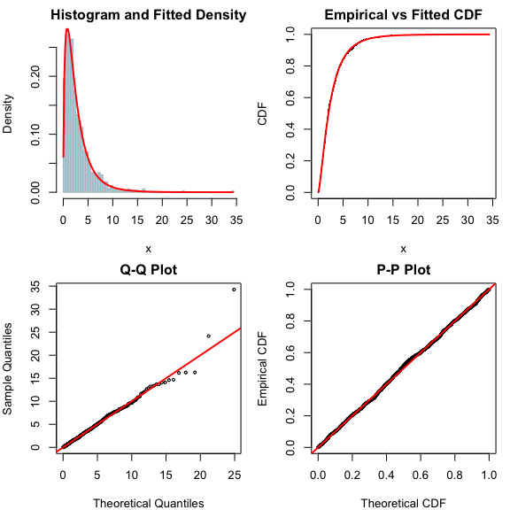
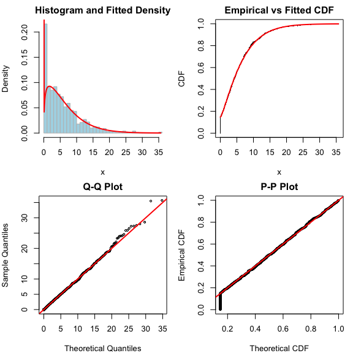
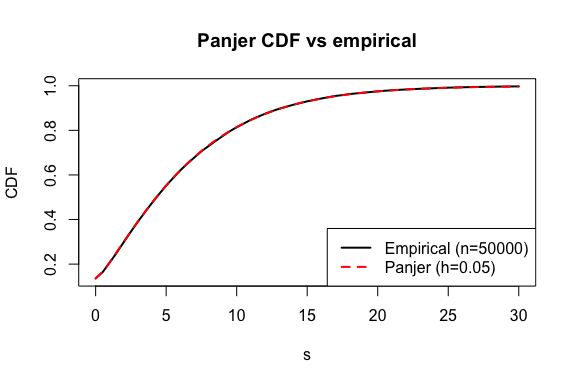

Fitting Continuous Distributions with fitegpd
================

The `fitegpd()` function provides a unified interface for fitting
univariate EGPD models by maximum likelihood. This vignette covers the
three continuous families:

1.  **Standard EGPD** (`family = "egpd"`) — parametric G-transformation
2.  **Bernstein EGPD** (`method = "bernstein"`) — semiparametric
    G-transformation using a Bernstein polynomial density
3.  **Compound Poisson EGPD** (`family = "cpegpd"`) — aggregated counts
    modelled via Panjer recursion

All three share the same GPD tail behaviour controlled by the shape
parameter $\xi$ and scale parameter $\sigma$, but differ in how they
model the body of the distribution.

## 1. Standard EGPD

The Extended GPD prepends a CDF transformation $G$ to the uniform
component of the GPD:

$$F(x) = G \bigl(H(x;\,\sigma,\xi)\bigr)$$

where $H$ is the standard GPD CDF. The `type` argument selects the
parametric form of $G$. Type 1 uses $G(u) = u^\kappa$ with a single
shape parameter $\kappa > 0$.

### Simulating and fitting

``` r
library(egpd)
set.seed(1)

# True parameters
sigma_true <- 2
xi_true    <- 0.1
kappa_true <- 1.5

x <- regpd(1000, sigma = sigma_true, xi = xi_true,
           kappa = kappa_true, type = 1)

fit_egpd <- fitegpd(x, type = 1, family = "egpd")
summary(fit_egpd)
```

    Fitting of the distribution 'egpd' (type 1)
    Method: mle

    Estimated parameters:
          Estimate Std. Error z value Pr(>|z|)    
    sigma  1.81412    0.15064  12.043  < 2e-16 ***
    xi     0.15344    0.03979   3.856 0.000115 ***
    kappa  1.61603    0.10592  15.257  < 2e-16 ***
    ---
    Signif. codes:  0 '***' 0.001 '**' 0.01 '*' 0.05 '.' 0.1 ' ' 1

    Convergence:  successful 
    Loglikelihood:  -2037.6   AIC:  4081.21   BIC:  4095.93 
    Number of observations:  1000 

### Diagnostics

The four-panel diagnostic plot shows the histogram with the fitted
density, empirical vs fitted CDF, a Q-Q plot, and a P-P plot.

``` r
plot(fit_egpd)
```



### Model comparison across types

Different types impose different shapes on $G$. We can compare them by
AIC:

``` r
aic_table <- data.frame(
  type = c(1, 4, 5),
  AIC = c(
    AIC(fitegpd(x, type = 1)),
    AIC(fitegpd(x, type = 4)),
    AIC(fitegpd(x, type = 5))
  )
)
aic_table
```

      type      AIC
    1    1 4081.205
    2    4 4083.362
    3    5 4083.240

Since the data were generated from Type 1, we expect it to have the
lowest AIC (or very close).

### Fixing parameters

Sometimes we want to fix one parameter at a known value. The `fix.arg`
argument removes it from optimization:

``` r
fit_fix <- fitegpd(x, type = 1, fix.arg = list(xi = 0.1))
summary(fit_fix)
```

    Fitting of the distribution 'egpd' (type 1)
    Method: mle

    Estimated parameters:
          Estimate Std. Error z value Pr(>|z|)    
    sigma  1.99292    0.08802   22.64   <2e-16 ***
    kappa  1.52398    0.07320   20.82   <2e-16 ***
    ---
    Signif. codes:  0 '***' 0.001 '**' 0.01 '*' 0.05 '.' 0.1 ' ' 1

    Fixed parameters:
       Value
    xi   0.1

    Convergence:  successful 
    Loglikelihood:  -2038.58   AIC:  4081.16   BIC:  4090.98 
    Number of observations:  1000 

The fixed parameter is shown separately in the summary output, and the
confidence intervals cover only the free parameters:

``` r
confint(fit_fix)
```

             2.5 %   97.5 %
    sigma 1.820400 2.165441
    kappa 1.380523 1.667447

## 2. Bernstein EGPD

The parametric $G$ in the standard EGPD may be too rigid for some
datasets. The Bernstein EGPD replaces it with a flexible Bernstein
polynomial density:

$$f(x) = b\!\bigl(H(x)^\kappa\bigr)\;\kappa\,H(x)^{\kappa-1}\,h(x)$$

where $b$ is a Bernstein polynomial density of degree $m$ with
softmax-parameterized weights. This gives a semiparametric model that
can approximate any smooth density on $(0,1)$.

### Fitting

Select `method = "bernstein"` and choose the polynomial degree with
`bernstein.m`. A two-stage procedure first estimates GPD parameters via
parametric MLE, then jointly optimizes all parameters.

``` r
fit_bern <- fitegpd(x, type = 1, method = "bernstein", bernstein.m = 8)
summary(fit_bern)
```

    Fitting of the distribution 'egpd' (type 1)
    Method: bernstein (Bernstein degree = 8)

    Estimated parameters:
          Estimate Std. Error z value Pr(>|z|)    
    sigma  1.46578    0.36935   3.968 7.23e-05 ***
    xi     0.17174    0.05082   3.380 0.000726 ***
    kappa  1.77748    0.38894   4.570 4.88e-06 ***
    ---
    Signif. codes:  0 '***' 0.001 '**' 0.01 '*' 0.05 '.' 0.1 ' ' 1

    Convergence:  successful 
    Loglikelihood:  -2036.2   AIC:  4092.4   BIC:  4141.48 
    Number of observations:  1000 

The reported parameters are only $\sigma$, $\xi$, and $\kappa$; the
Bernstein weights are stored internally. The effective number of
parameters is $3 + (m - 1)$ since the $m$ weights sum to 1.

### Comparing parametric and semiparametric fits

``` r
cat("Parametric AIC:     ", AIC(fit_egpd), "\n")
```

    Parametric AIC:      4081.205 

``` r
cat("Bernstein (m=8) AIC:", AIC(fit_bern), "\n")
```

    Bernstein (m=8) AIC: 4092.405 

For well-specified parametric data the standard EGPD typically wins on
AIC due to fewer effective parameters. The Bernstein model is most
useful when the true $G$ is unknown or does not match any of the six
parametric types.

### Diagnostics

``` r
plot(fit_bern)
```


### Sensitivity to Bernstein degree

``` r
aic_m <- sapply(c(4, 6, 8, 12), function(m) {
  AIC(fitegpd(x, type = 1, method = "bernstein", bernstein.m = m))
})
data.frame(m = c(4, 6, 8, 12), AIC = round(aic_m, 2))
```

       m     AIC
    1  4 4086.59
    2  6 4088.85
    3  8 4092.40
    4 12 4097.91

## 3. Compound Poisson EGPD

The Compound Poisson EGPD models aggregated positive data (e.g. total
rainfall over a period) as the random sum $S = X_1 + \cdots + X_N$
where:

- $N \sim \mathrm{Poisson}(\lambda)$ is the number of events, and
- $X_i \sim \mathrm{EGPD}(\sigma, \xi, \kappa)$ are i.i.d. event sizes.

The distribution of $S$ has a point mass at zero
($P(S=0) = e^{-\lambda}$) and a continuous positive part. The PMF is
evaluated via **Panjer recursion** on a discretized EGPD severity.

This model is described in [Naveau et
al. (2025)](https://arxiv.org/abs/2601.08350) for aggregated rainfall.

### Panjer recursion

The severity CDF is discretized on a grid $\{0, h, 2h, \ldots\}$ using
the mean-preserving rounding method:
$$f_0 = F_{\mathrm{EGPD}}(h/2),\qquad
f_k = F_{\mathrm{EGPD}}\!\bigl((k+\tfrac12)h\bigr) -
F_{\mathrm{EGPD}}\!\bigl((k-\tfrac12)h\bigr),\quad k \ge 1$$ The
compound distribution is then computed recursively:
$$g_0 = e^{-\lambda(1-f_0)},\qquad
g_k = \frac{\lambda}{k}\sum_{j=1}^{k} j\,f_j\,g_{k-j},\quad k \ge 1$$

### Simulating compound Poisson-EGPD data

The `rcpegpd()` function uses direct simulation (no Panjer needed): draw
$N \sim \mathrm{Poisson}(\lambda)$, then sum $N$ i.i.d. EGPD draws.

``` r
set.seed(42)
sigma_true  <- 2
xi_true     <- 0.1
kappa_true  <- 1.5
lambda_true <- 2

y <- rcpegpd(1000, sigma = sigma_true, xi = xi_true,
             kappa = kappa_true, lambda = lambda_true, type = 1)

cat("Proportion of zeros:", mean(y == 0), "\n")
```

    Proportion of zeros: 0.147 

``` r
cat("Theoretical P(S=0):", exp(-lambda_true), "\n")
```

    Theoretical P(S=0): 0.1353353 

``` r
cat("Mean:", round(mean(y), 2), "\n")
```

    Mean: 5.62 

``` r
hist(y, breaks = 40, freq = FALSE, col = "lightblue", border = "grey",
     main = "Simulated Compound Poisson-EGPD data", xlab = "S")
```


### Fitting

Select `family = "cpegpd"`. The discretization step size is controlled
by `cpegpd.h` (default 0.2); smaller values give better accuracy at the
cost of speed.

``` r
fit_cp <- fitegpd(y, type = 1, family = "cpegpd", cpegpd.h = 0.1)
summary(fit_cp)
```

    Fitting of the distribution 'cpegpd' (type 1)
    Method: mle (cpegpd discretization h = 0.1)

    Estimated parameters:
           Estimate Std. Error z value Pr(>|z|)    
    sigma   2.09304    0.30220   6.926 4.33e-12 ***
    xi      0.08062    0.06037   1.335    0.182    
    kappa   1.49342    0.19439   7.682 1.56e-14 ***
    lambda  1.91981    0.07678  25.003  < 2e-16 ***
    ---
    Signif. codes:  0 '***' 0.001 '**' 0.01 '*' 0.05 '.' 0.1 ' ' 1

    Convergence:  successful 
    Loglikelihood:  -4808.26   AIC:  9624.53   BIC:  9644.16 
    Number of observations:  1000 

``` r
truth <- c(sigma = sigma_true, xi = xi_true,
           kappa = kappa_true, lambda = lambda_true)
est <- fit_cp$estimate
cbind(true = truth, estimate = round(est, 4),
      SE = round(fit_cp$sd, 4))
```

           true estimate     SE
    sigma   2.0   2.0930 0.3022
    xi      0.1   0.0806 0.0604
    kappa   1.5   1.4934 0.1944
    lambda  2.0   1.9198 0.0768

### Diagnostics

``` r
plot(fit_cp)
```



### Checking the Panjer approximation

We can verify that the Panjer-based CDF matches the empirical
distribution from a large simulation:

``` r
set.seed(1)
y_large <- rcpegpd(50000, sigma = sigma_true, xi = xi_true,
                    kappa = kappa_true, lambda = lambda_true, type = 1)
qvals <- seq(0, 30, by = 0.5)
emp_cdf <- sapply(qvals, function(q) mean(y_large <= q))
theo_cdf <- pcpegpd(qvals, lambda = lambda_true, sigma = sigma_true,
                     xi = xi_true, kappa = kappa_true, type = 1, h = 0.05)

plot(qvals, emp_cdf, type = "l", lwd = 2,
     xlab = "s", ylab = "CDF", main = "Panjer CDF vs empirical")
lines(qvals, theo_cdf, col = "red", lwd = 2, lty = 2)
legend("bottomright", c("Empirical (n=50000)", "Panjer (h=0.05)"),
       col = c("black", "red"), lty = 1:2, lwd = 2)
```



### Effect of discretization step size

Smaller `h` gives a more accurate approximation but increases
computation time:

``` r
h_grid <- c(0.5, 0.2, 0.1, 0.05)
aic_h <- sapply(h_grid, function(hv) {
  AIC(fitegpd(y, type = 1, family = "cpegpd", cpegpd.h = hv))
})
data.frame(h = h_grid, AIC = round(aic_h, 2))
```

         h      AIC
    1 0.50  6826.97
    2 0.20  8423.21
    3 0.10  9624.53
    4 0.05 10817.72

The AIC stabilises for sufficiently small `h`, indicating that the
discretization error is negligible. We recommend `h = 0.1` as a good
default for most applications.

### Confidence intervals

``` r
confint(fit_cp)
```

                 2.5 %    97.5 %
    sigma   1.50074025 2.6853474
    xi     -0.03770876 0.1989388
    kappa   1.11242047 1.8744276
    lambda  1.76932217 2.0703067

### Fixing parameters

As with other families, individual parameters can be fixed:

``` r
fit_cp_fix <- fitegpd(y, type = 1, family = "cpegpd",
                       fix.arg = list(xi = 0.1), cpegpd.h = 0.1)
summary(fit_cp_fix)
```

    Fitting of the distribution 'cpegpd' (type 1)
    Method: mle (cpegpd discretization h = 0.1)

    Estimated parameters:
           Estimate Std. Error z value Pr(>|z|)    
    sigma   2.00603    0.12407   16.17   <2e-16 ***
    kappa   1.53851    0.14254   10.79   <2e-16 ***
    lambda  1.92366    0.07586   25.36   <2e-16 ***
    ---
    Signif. codes:  0 '***' 0.001 '**' 0.01 '*' 0.05 '.' 0.1 ' ' 1

    Fixed parameters:
       Value
    xi   0.1

    Convergence:  successful 
    Loglikelihood:  -4808.32   AIC:  9622.64   BIC:  9637.36 
    Number of observations:  1000 

## Summary

| Method | Family | Parameters | Use case |
|----|----|----|----|
| `method="mle"` | `"egpd"` | $\sigma, \xi$ + type-specific | Standard parametric EGPD |
| `method="bernstein"` | `"egpd"` | $\sigma, \xi, \kappa$ + weights | Flexible body, unknown $G$ |
| `method="mle"` | `"cpegpd"` | $\sigma, \xi$ + type-specific + $\lambda$ | Aggregated data with zeros |

All three approaches:

- Return S3 objects of class `"fitegpd"` with the same interface
  (`summary`, `plot`, `AIC`, `confint`, `coef`, `vcov`, `logLik`)
- Support `fix.arg` for fixing parameters at known values
- Estimate standard errors via the delta method on the Hessian
- Provide four-panel diagnostic plots
