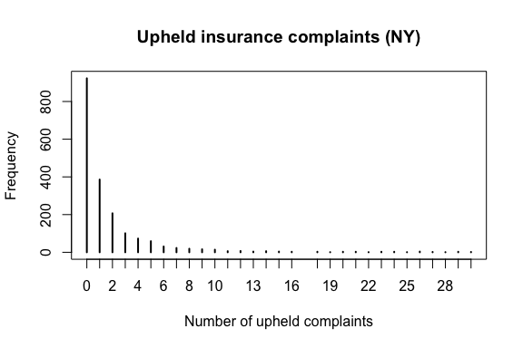
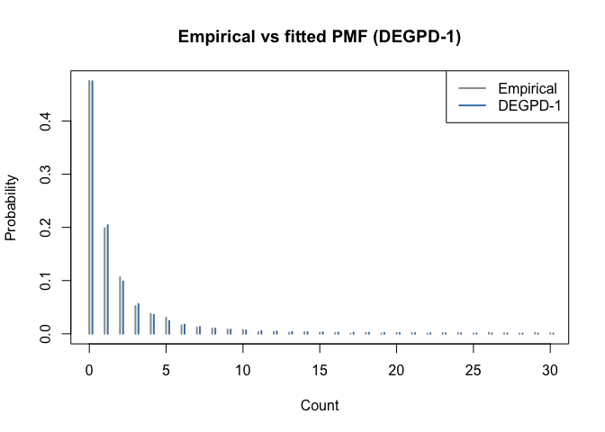
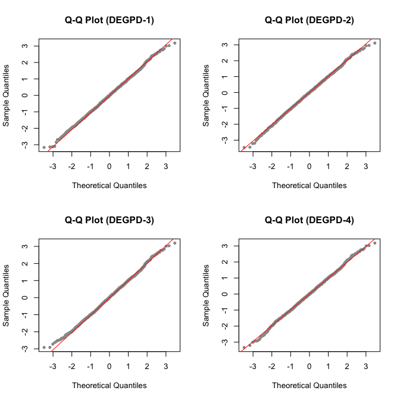

Discrete EGPD Models for Insurance Complaint Counts
================

This vignette demonstrates fitting Discrete Extended Generalized Pareto
Distribution (DEGPD) models to insurance complaint count data using the
`egpd` package. The data record the number of upheld complaints against
automobile insurance companies in New York State.

## Data

``` r
library(egpd)
data(ny_complaints)
str(ny_complaints)
```

    'data.frame':   1942 obs. of  4 variables:
     $ year    : int  2020 2020 2020 2020 2020 2020 2020 2020 2020 2020 ...
     $ upheld  : int  0 0 0 0 0 0 0 0 0 0 ...
     $ total   : int  20 2 13 5 0 4 5 5 3 5 ...
     $ premiums: num  107.1 65 63.5 53.2 43.8 ...

The response variable is the number of upheld complaints per insurer per
year. These are non-negative integer counts with a heavy right tail.

``` r
y <- ny_complaints$upheld
plot(table(y[y <= 30]), main = "Upheld insurance complaints (NY)",
     xlab = "Number of upheld complaints", ylab = "Frequency")
```



``` r
cat("n =", length(y), " range:", range(y), "\n")
```

    n = 1942  range: 0 265 

## Fitting DEGPD models

The `egpd()` function fits DEGPD models within a GAM framework. For
intercept-only models (no covariates), each parameter gets a `~ 1`
formula. The DEGPD family uses a log link for the scale (`sigma`) and
shape (`xi`) parameters, so the fitted coefficients are on the log
scale.

### DEGPD Model 1: Power transformation

Model 1 uses G(u) = u^kappa with three parameters: sigma, xi, kappa.

``` r
df <- data.frame(y = y, x = rep(1, length(y)))
fit1 <- egpd(list(lsigma = y ~ 1, lxi = ~ 1, lkappa = ~ 1),
             data = df, family = "degpd", degpd.args = list(m = 1))
summary(fit1)
```


    ** Parametric terms **

    logscale
                Estimate Std. Error t value Pr(>|t|)
    (Intercept)    -0.23       0.27   -0.85    0.198

    logshape
                Estimate Std. Error t value Pr(>|t|)
    (Intercept)    -0.32       0.08   -4.06 2.44e-05

    logkappa
                Estimate Std. Error t value Pr(>|t|)
    (Intercept)     0.35       0.22    1.57    0.058

    ** Smooth terms **

``` r
cat("Log-likelihood:", logLik(fit1), "\n")
```

    Log-likelihood: -3645.223 

``` r
cat("AIC:", AIC(fit1), "\n")
```

    AIC: 7296.447 

### DEGPD Model 2: Mixture of power transformations

Model 2 uses G(u) = p·u^kappa1 + (1-p)·u^kappa2 with five parameters:
sigma, xi, kappa1, dkappa, p.

``` r
fit2 <- egpd(list(lsigma = y ~ 1, lxi = ~ 1, lkappa1 = ~ 1, ldkappa = ~ 1,
                  logitp = ~ 1),
             data = df, family = "degpd", degpd.args = list(m = 2))
```

    Final Hessian of negative penalized log-likelihood not numerically positive definite.

``` r
summary(fit2)
```

    Warning in sqrt(obj$Vp[cbind(id2, id2)]): NaNs produced
    Warning in sqrt(obj$Vp[cbind(id2, id2)]): NaNs produced
    Warning in sqrt(obj$Vp[cbind(id2, id2)]): NaNs produced


    ** Parametric terms **

    logscale
                Estimate Std. Error t value Pr(>|t|)
    (Intercept)   -13.18        NaN     NaN      NaN

    logshape
                Estimate Std. Error t value Pr(>|t|)
    (Intercept)    -0.24       0.03   -8.11 2.63e-16

    logkappa1
                Estimate Std. Error t value Pr(>|t|)
    (Intercept)     3.66        NaN     NaN      NaN

    logdkappa
                Estimate Std. Error t value Pr(>|t|)
    (Intercept)     16.9        NaN     NaN      NaN

    logitp
                Estimate Std. Error t value Pr(>|t|)
    (Intercept)    -0.58       0.12    -4.7 1.32e-06

    ** Smooth terms **

``` r
cat("Log-likelihood:", logLik(fit2), "\n")
```

    Log-likelihood: -3646.202 

``` r
cat("AIC:", AIC(fit2), "\n")
```

    AIC: 7302.405 

### DEGPD Model 3: Incomplete beta transformation

Model 3 uses an incomplete beta transformation with three parameters:
sigma, xi, delta.

``` r
fit3 <- egpd(list(lsigma = y ~ 1, lxi = ~ 1, ldelta = ~ 1),
             data = df, family = "degpd", degpd.args = list(m = 3))
summary(fit3)
```


    ** Parametric terms **

    logscale
                Estimate Std. Error t value Pr(>|t|)
    (Intercept)    -0.02       0.15   -0.15    0.439

    logshape
                Estimate Std. Error t value Pr(>|t|)
    (Intercept)    -0.34       0.08   -4.29 8.93e-06

    logdelta
                Estimate Std. Error t value Pr(>|t|)
    (Intercept)     2.02       0.73    2.75  0.00295

    ** Smooth terms **

``` r
cat("Log-likelihood:", logLik(fit3), "\n")
```

    Log-likelihood: -3645.448 

``` r
cat("AIC:", AIC(fit3), "\n")
```

    AIC: 7296.895 

### DEGPD Model 4: Power-beta transformation

Model 4 combines the incomplete beta and power transformations with four
parameters: sigma, xi, delta, kappa.

``` r
fit4 <- egpd(list(lsigma = y ~ 1, lxi = ~ 1, ldelta = ~ 1, lkappa = ~ 1),
             data = df, family = "degpd", degpd.args = list(m = 4))
summary(fit4)
```


    ** Parametric terms **

    logscale
                Estimate Std. Error t value Pr(>|t|)
    (Intercept)    -0.22       0.28   -0.77    0.221

    logshape
                Estimate Std. Error t value Pr(>|t|)
    (Intercept)    -0.32       0.08   -4.05  2.6e-05

    logdelta
                Estimate Std. Error t value Pr(>|t|)
    (Intercept)     4.52       7.23    0.62    0.266

    logkappa
                Estimate Std. Error t value Pr(>|t|)
    (Intercept)     1.02       0.28    3.62 0.000146

    ** Smooth terms **

``` r
cat("Log-likelihood:", logLik(fit4), "\n")
```

    Log-likelihood: -3646.155 

``` r
cat("AIC:", AIC(fit4), "\n")
```

    AIC: 7300.31 

## Model comparison

``` r
aic_table <- data.frame(
  Model = c("DEGPD-1", "DEGPD-2", "DEGPD-3", "DEGPD-4"),
  npar = c(3, 5, 3, 4),
  logLik = c(logLik(fit1), logLik(fit2), logLik(fit3), logLik(fit4)),
  AIC = c(AIC(fit1), AIC(fit2), AIC(fit3), AIC(fit4))
)
aic_table
```

        Model npar    logLik      AIC
    1 DEGPD-1    3 -3645.223 7296.447
    2 DEGPD-2    5 -3646.202 7302.405
    3 DEGPD-3    3 -3645.448 7296.895
    4 DEGPD-4    4 -3646.155 7300.310

## Goodness of fit

We can assess model fit by comparing the empirical and fitted PMFs.

``` r
# Extract fitted parameters on the response scale
pars1 <- predict(fit1, type = "response")
sigma1 <- pars1$scale[1]; xi1 <- pars1$shape[1]; kappa1 <- pars1$kappa[1]

xvals <- 0:30
emp_pmf <- tabulate(y + 1, nbins = max(xvals) + 1) / length(y)
emp_pmf <- emp_pmf[seq_along(xvals)]

fit_pmf1 <- ddiscegpd(xvals, sigma = sigma1, xi = xi1, kappa = kappa1, type = 1)

plot(xvals, emp_pmf, type = "h", lwd = 2, col = "grey60",
     main = "Empirical vs fitted PMF (DEGPD-1)",
     xlab = "Count", ylab = "Probability")
lines(xvals + 0.2, fit_pmf1, type = "h", lwd = 2, col = "steelblue")
legend("topright", legend = c("Empirical", "DEGPD-1"),
       col = c("grey60", "steelblue"), lwd = 2)
```



## Q-Q plots

Randomized quantile residuals provide a model-agnostic diagnostic: if
the model is correct, the residuals should follow a standard normal
distribution. The `rqresid()` function computes these by drawing a
uniform variate between the lower and upper CDF bounds at each
observation and transforming to the normal scale.

``` r
set.seed(1)
par(mfrow = c(2, 2))

r1 <- rqresid(fit1)
qqnorm(r1, main = "Q-Q Plot (DEGPD-1)", pch = 20, col = "grey60")
qqline(r1, col = "red")

r2 <- rqresid(fit2)
qqnorm(r2, main = "Q-Q Plot (DEGPD-2)", pch = 20, col = "grey60")
qqline(r2, col = "red")

r3 <- rqresid(fit3)
qqnorm(r3, main = "Q-Q Plot (DEGPD-3)", pch = 20, col = "grey60")
qqline(r3, col = "red")

r4 <- rqresid(fit4)
qqnorm(r4, main = "Q-Q Plot (DEGPD-4)", pch = 20, col = "grey60")
qqline(r4, col = "red")
```



``` r
par(mfrow = c(1, 1))
```

## Quantile predictions

The `predict` method with `type = "quantile"` computes quantile
estimates from the fitted model.

``` r
probs <- c(0.5, 0.9, 0.95, 0.99)
qpred <- predict(fit1, type = "quantile", prob = probs)
qpred[1, ]
```

      q:0.5 q:0.9 q:0.95 q:0.99
    1     1     6     11     38

Compare with empirical quantiles:

``` r
emp_q <- quantile(y, probs)
cbind(prob = probs, empirical = emp_q, fitted = unlist(qpred[1, ]))
```

        prob empirical fitted
    50% 0.50      1.00      1
    90% 0.90      5.00      6
    95% 0.95     10.00     11
    99% 0.99     47.18     38
