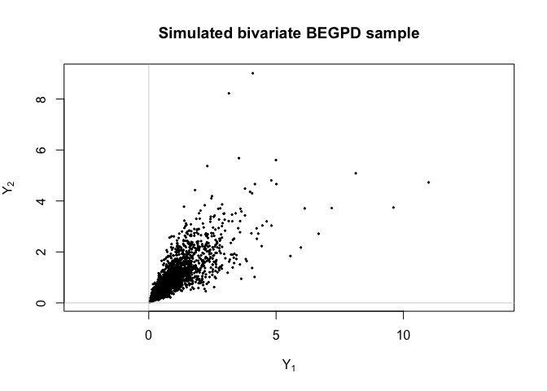
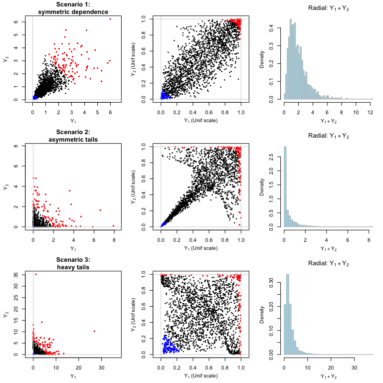
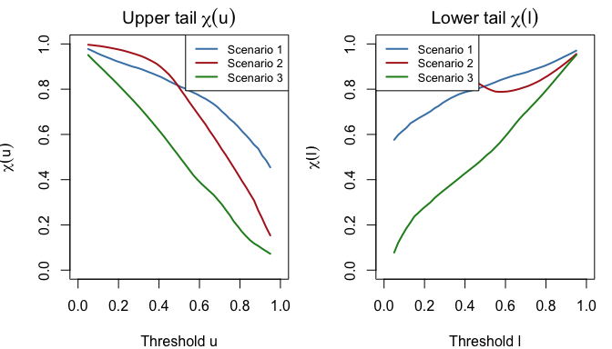
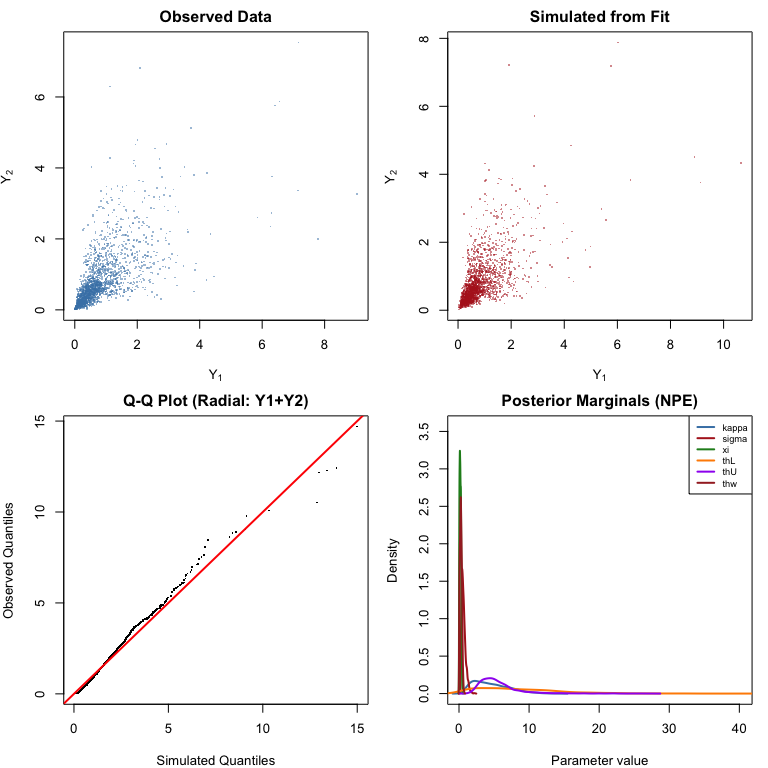

Bivariate BEGPD via Neural Bayes Estimation
================

The `egpd` package supports Bivariate Extended Generalized Pareto
Distribution (BEGPD) models, fitted via neural Bayes estimation. Unlike
the univariate `fitegpd()` methods that use maximum likelihood, the
bivariate BEGPD uses pre-trained neural networks to perform amortized
inference – either posterior sampling (NPE) or point estimation (NBE).

This vignette covers:

1.  **The BEGPD model** – construction and parameters
2.  **Simulating bivariate data** – `rbegpd()` (pure R, no Julia needed)
3.  **Illustrative scenarios** – how parameters shape the dependence
    structure
4.  **Neural Bayes estimation** – fitting via
    `fitegpd(family = "begpd")`
5.  **Diagnostics and inference** – S3 methods, posterior summaries, and
    plots
6.  **Training custom models** – `train_begpd()`

## 1. The bivariate BEGPD model

The BEGPD jointly models two variables $(Y_1, Y_2)$ by decomposing them
into a radial (intensity) component and angular (dependence) components.

### Radial component

The intensity $R$ follows a power-transformed GPD:

$$R = \frac{\sigma}{\xi}\left[\left(1 - U^{1/\kappa}\right)^{-\xi} - 1\right], \qquad U \sim \mathrm{Uniform}(0,1)$$

where $\kappa > 0$ is the EGPD shape, $\sigma > 0$ is the GPD scale, and
$\xi > 0$ is the GPD shape parameter. The CDF of $R$ is the EGPD CDF:

$$F_R(r) = \left[1 - \left(1 + \xi\, r / \sigma\right)^{-1/\xi}\right]^\kappa$$

### Lower and upper tail dependence

The angular structure is governed by two symmetric Beta distributions
that control the lower and upper tail behaviour respectively:

- **Lower tail angles:** $V_1 \sim \mathrm{Beta}(\theta_L, \theta_L)$,
  with $L_1 = 1/V_1$ and $L_2 = 1/(1-V_1)$
- **Upper tail angles:** $U_1 \sim \mathrm{Beta}(\theta_U, \theta_U)$,
  with $U_2 = 1 - U_1$

Large values of $\theta_L$ or $\theta_U$ concentrate the angular
distribution around equal splitting (independence), while small values
induce stronger dependence.

### Mixing

A weight function smoothly transitions between the lower and upper tail
regimes. Given the radial quantile $u = F_R(R)$, the weight is:

$$w(u) = F_{\mathrm{Beta}(3,3)}\!\left(\frac{u - \theta_\omega}{1 - 2\theta_\omega}\right)$$

where $\theta_\omega \in (0, 0.5)$ controls the transition point. The
bivariate observations are then:

$$Y_1 = R\left[(1-w)\,V_1 + w\,U_1\right], \qquad Y_2 = R\left[(1-w)\,(1-V_1) + w\,U_2\right]$$

### Parameter summary

| Parameter | Symbol          | Range         | Role                       |
|-----------|-----------------|---------------|----------------------------|
| `kappa`   | $\kappa$        | $(0, \infty)$ | EGPD shape (intensity)     |
| `sigma`   | $\sigma$        | $(0, \infty)$ | GPD scale (intensity)      |
| `xi`      | $\xi$           | $(0, \infty)$ | GPD shape (tail heaviness) |
| `thL`     | $\theta_L$      | $(0, \infty)$ | Lower tail dependence      |
| `thU`     | $\theta_U$      | $(0, \infty)$ | Upper tail dependence      |
| `thw`     | $\theta_\omega$ | $(0, 0.5)$    | Lower/upper transition     |

## 2. Simulating bivariate data

The `rbegpd()` function generates bivariate samples from the BEGPD. It
is pure R and does **not** require Julia.

``` r
library(egpd)
set.seed(42)

Y <- rbegpd(2000, kappa = 3, sigma = 1, xi = 0.1,
            thL = 10, thU = 10, thw = 0.25)
head(Y)
```

                Y1        Y2
    [1,] 2.8277805 1.4084486
    [2,] 2.5063541 2.1793926
    [3,] 0.6210209 0.5147301
    [4,] 1.1398503 2.1080683
    [5,] 1.1267881 1.0683751
    [6,] 0.8451407 0.9228765

``` r
dim(Y)
```

    [1] 2000    2

``` r
plot(Y[, 1], Y[, 2], pch = 20, cex = 0.4, asp = 1,
     xlab = expression(Y[1]), ylab = expression(Y[2]),
     main = "Simulated bivariate BEGPD sample")
abline(h = 0, v = 0, col = "lightgrey")
```



## 3. Illustrative scenarios

The six parameters of the BEGPD control different aspects of the
bivariate distribution. We illustrate three scenarios that highlight
these effects.

``` r
scenarios <- list(
  "Scenario 1:\nsymmetric dependence" = list(
    kappa = 3, sigma = 1, xi = 0.05, thL = 10, thU = 10, thw = 0.25
  ),
  "Scenario 2:\nasymmetric tails" = list(
    kappa = 0.3, sigma = 1, xi = 0.05, thL = 10, thU = 0.5, thw = 0.25
  ),
  "Scenario 3:\nheavy tails" = list(
    kappa = 3, sigma = 1, xi = 0.2, thL = 4, thU = 0.5, thw = 0.25
  )
)
```

``` r
set.seed(198345)
n <- 2000
op <- par(mfrow = c(3, 3), mar = c(4, 4, 2.5, 1), mgp = c(2.5, 1, 0))

for (i in seq_along(scenarios)) {
  sc <- scenarios[[i]]
  Y <- rbegpd(n, kappa = sc$kappa, sigma = sc$sigma, xi = sc$xi,
              thL = sc$thL, thU = sc$thU, thw = sc$thw)
  R <- Y[, 1] + Y[, 2]
  ind_upp <- which(R > quantile(R, 0.95))
  ind_low <- which(R < quantile(R, 0.05))

  # Panel 1: scatter on original scale
  plot(Y[, 1], Y[, 2], pch = 20, cex = 0.4, asp = 1,
       xlim = range(Y), ylim = range(Y),
       xlab = expression(Y[1]), ylab = expression(Y[2]),
       main = names(scenarios)[i])
  points(Y[ind_upp, 1], Y[ind_upp, 2], pch = 20, col = "red", cex = 0.6)
  points(Y[ind_low, 1], Y[ind_low, 2], pch = 20, col = "blue", cex = 0.6)
  abline(h = 0, v = 0, col = "lightgrey")

  # Panel 2: scatter on uniform (copula) scale
  U1 <- rank(Y[, 1]) / (n + 1)
  U2 <- rank(Y[, 2]) / (n + 1)
  plot(U1, U2, pch = 20, cex = 0.4, asp = 1, xlim = c(0, 1), ylim = c(0, 1),
       xlab = expression(Y[1] ~ "(Unif scale)"),
       ylab = expression(Y[2] ~ "(Unif scale)"))
  points(U1[ind_upp], U2[ind_upp], pch = 20, col = "red", cex = 0.6)
  points(U1[ind_low], U2[ind_low], pch = 20, col = "blue", cex = 0.6)
  abline(h = c(0, 1), v = c(0, 1), col = "lightgrey")

  # Panel 3: marginal histograms of radial component
  hist(R, breaks = 50, freq = FALSE, col = "lightblue", border = "grey",
       main = expression("Radial: " * Y[1] + Y[2]),
       xlab = expression(Y[1] + Y[2]))
}
```



``` r
par(op)
```

**Interpretation:**

- **Scenario 1** ($\kappa=3$, $\theta_L=\theta_U=10$): Symmetric
  dependence in both tails. The upper and lower extremes (red and blue)
  are roughly equally spread.
- **Scenario 2** ($\kappa=0.3$, $\theta_U=0.5$): Small $\kappa$
  concentrates mass near zero, while small $\theta_U$ induces strong
  upper tail dependence (red points cluster along the diagonal).
- **Scenario 3** ($\xi=0.2$, $\theta_L=4$, $\theta_U=0.5$): Heavier GPD
  tail ($\xi=0.2$) and stronger dependence in both tails.

### Tail dependence measures

We can quantify the dependence structure using the chi coefficients. For
threshold $u$:

$$\chi(u) = P(F_{Y_2}(Y_2) > u \mid F_{Y_1}(Y_1) > u)$$

``` r
set.seed(1)
n_big <- 50000

chi_u <- function(data, u) {
  U1 <- rank(data[, 1]) / (nrow(data) + 1)
  U2 <- rank(data[, 2]) / (nrow(data) + 1)
  sum(U1 > u & U2 > u) / sum(U1 > u)
}
chi_l <- function(data, l) {
  U1 <- rank(data[, 1]) / (nrow(data) + 1)
  U2 <- rank(data[, 2]) / (nrow(data) + 1)
  sum(U1 < l & U2 < l) / sum(U1 < l)
}

thresholds <- seq(0.05, 0.95, by = 0.02)

op <- par(mfrow = c(1, 2), mar = c(4, 4, 2, 1))
cols <- c("steelblue", "firebrick", "forestgreen")

# Upper tail chi
plot(0, 0, type = "n", xlim = c(0, 1), ylim = c(0, 1),
     xlab = "Threshold u", ylab = expression(chi(u)),
     main = expression("Upper tail " * chi(u)))
for (i in seq_along(scenarios)) {
  sc <- scenarios[[i]]
  Y_big <- rbegpd(n_big, kappa = sc$kappa, sigma = sc$sigma, xi = sc$xi,
                  thL = sc$thL, thU = sc$thU, thw = sc$thw)
  chi_vals <- sapply(thresholds, function(u) chi_u(Y_big, u))
  lines(thresholds, chi_vals, col = cols[i], lwd = 2)
}
legend("topright", legend = paste("Scenario", 1:3), col = cols, lwd = 2,
       cex = 0.8, bg = "white")

# Lower tail chi
plot(0, 0, type = "n", xlim = c(0, 1), ylim = c(0, 1),
     xlab = "Threshold l", ylab = expression(chi(l)),
     main = expression("Lower tail " * chi(l)))
for (i in seq_along(scenarios)) {
  sc <- scenarios[[i]]
  Y_big <- rbegpd(n_big, kappa = sc$kappa, sigma = sc$sigma, xi = sc$xi,
                  thL = sc$thL, thU = sc$thU, thw = sc$thw)
  chi_vals <- sapply(thresholds, function(l) chi_l(Y_big, l))
  lines(thresholds, chi_vals, col = cols[i], lwd = 2)
}
legend("topleft", legend = paste("Scenario", 1:3), col = cols, lwd = 2,
       cex = 0.8, bg = "white")
```



``` r
par(op)
```

## 4. Neural Bayes estimation

### Why neural estimation?

The bivariate BEGPD has six parameters and no closed-form likelihood for
the joint distribution. Traditional likelihood-moment approaches require
a multi-stage procedure: (1) fit the radial EGPD by MLE, (2) estimate
the angular parameters by matching moments in the tails, and (3)
estimate the mixing parameter by least-squares on the covariance. This
is slow and can be sensitive to threshold choices.

**Neural Bayes estimation** sidesteps the likelihood entirely. A neural
network is trained on simulated data to learn the mapping from data to
parameters. Once trained, inference on new datasets is nearly instant.

The `egpd` package supports two estimators:

| Estimator | Method | Output |
|----|----|----|
| **NPE** (Neural Posterior Estimator) | Normalising flow | Full approximate posterior (samples) |
| **NBE** (Neural Bayesian Estimator) | Ensemble of point estimators | Point estimates only |

Both use a **DeepSet** architecture that can handle varying sample
sizes.

### Prerequisites

Neural Bayes estimation requires Julia (\>= 1.11) and additional
packages:

``` r
# R packages
install.packages("JuliaConnectoR")
remotes::install_github("msainsburydale/NeuralEstimators")

# Julia packages (run in Julia REPL)
# using Pkg
# Pkg.add(["NeuralEstimators", "Flux"])
```

### Fitting with NPE

The NPE provides full posterior inference: given data, it returns
samples from the approximate posterior distribution over all six
parameters.

``` r
set.seed(42)

# Simulate data from known parameters
Y <- rbegpd(2000, kappa = 2, sigma = 1, xi = 0.1,
            thL = 5, thU = 5, thw = 0.2)

# Fit using Neural Posterior Estimation
fit_npe <- fitegpd(Y, family = "begpd", method = "neuralbayes",
                   estimator = "npe", nsamples = 2000)
```

    Starting Julia ...

The `nsamples` argument controls how many draws are taken from the
approximate posterior (default: 1000). More samples give smoother
posterior summaries at the cost of slightly longer inference.

``` r
summary(fit_npe)
```

    Fitting of bivariate BEGPD
    Method: neuralbayes (npe)  [2000 posterior samples]

    Posterior summary:
          Median Post.SD   2.5%   97.5%
    kappa 4.1220  2.5063 1.0773 10.1140
    sigma 0.5883  0.2957 0.2721  1.3810
    xi    0.1803  0.1069 0.0148  0.4003
    thL   7.0989  5.9595 0.5358 22.6098
    thU   4.9169  3.0116 2.2953 13.7070
    thw   0.2598  0.1427 0.0321  0.5593

    Note: log-likelihood, AIC, and BIC are not available for neural estimation
    Number of observations:  2000 

The summary provides:

- **Median**: Posterior median (point estimate)
- **Post.SD**: Posterior standard deviation
- **2.5% / 97.5%**: 95% credible interval from posterior quantiles

### Fitting with NBE

The NBE is faster but only provides point estimates (no uncertainty
quantification):

``` r
fit_nbe <- fitegpd(Y, family = "begpd", method = "neuralbayes",
                   estimator = "nbe")
summary(fit_nbe)
```

    Fitting of bivariate BEGPD
    Method: neuralbayes (nbe)

    Estimated parameters:
          Estimate SE
    kappa   2.8949 NA
    sigma   0.7741 NA
    xi      0.2000 NA
    thL     8.0920 NA
    thU     3.8026 NA
    thw     0.2455 NA

    Note: log-likelihood, AIC, and BIC are not available for neural estimation
    Number of observations:  2000 

## 5. Diagnostics and inference

### Diagnostic plots

The `plot()` method produces a 4-panel diagnostic plot adapted for
bivariate data:

``` r
plot(fit_npe)
```



The panels show:

1.  **Observed scatter** – the input data $(Y_1, Y_2)$
2.  **Simulated scatter** – data generated from the fitted model via
    `rbegpd()` with the estimated parameters
3.  **Radial Q-Q plot** – quantiles of $Y_1+Y_2$ (observed vs simulated)
4.  **Posterior marginals** (NPE) or **parameter bar chart** (NBE)

### Extracting estimates

Standard S3 methods work as expected:

``` r
# Point estimates (posterior median for NPE)
coef(fit_npe)
```

        kappa     sigma        xi       thL       thU       thw 
    4.1219923 0.5882915 0.1803492 7.0989270 4.9168750 0.2598206 

``` r
# Variance-covariance (from posterior sample covariance for NPE)
vcov(fit_npe)
```

                kappa        sigma            xi          thL         thU
    kappa  6.28149956 -0.600174713  0.1356676916  0.615366205  0.69632997
    sigma -0.60017471  0.087410248 -0.0217106734  0.082408563 -0.16548903
    xi     0.13566769 -0.021710673  0.0114364951 -0.003120395  0.01071749
    thL    0.61536620  0.082408563 -0.0031203950 35.515969009 -9.98016365
    thU    0.69632997 -0.165489034  0.0107174887 -9.980163649  9.06983086
    thw    0.04403949 -0.004459596  0.0004874291  0.055442498  0.09548363
                    thw
    kappa  0.0440394870
    sigma -0.0044595961
    xi     0.0004874291
    thL    0.0554424982
    thU    0.0954836337
    thw    0.0203693849

``` r
# 95% credible intervals (from posterior quantiles for NPE)
confint(fit_npe)
```

               2.5 %     97.5 %
    kappa 1.07734891 10.1139706
    sigma 0.27213202  1.3809894
    xi    0.01480625  0.4002942
    thL   0.53575858 22.6098260
    thU   2.29525945 13.7069981
    thw   0.03209281  0.5593284

``` r
confint(fit_npe, level = 0.90)
```

                 5 %       95 %
    kappa 1.29378743  9.1121527
    sigma 0.29585897  1.2350336
    xi    0.03052533  0.3707822
    thL   0.87888364 19.5608631
    thU   2.56212948 10.8467310
    thw   0.04807524  0.5113078

``` r
# Subset parameters
confint(fit_npe, parm = c("kappa", "xi"))
```

               2.5 %     97.5 %
    kappa 1.07734891 10.1139706
    xi    0.01480625  0.4002942

### Comparing to true values

Since we know the true parameters, we can assess the estimation quality:

``` r
truth <- c(kappa = 2, sigma = 1, xi = 0.1, thL = 5, thU = 5, thw = 0.2)
est <- coef(fit_npe)
ci <- confint(fit_npe)

comparison <- data.frame(
  True = truth,
  Estimate = round(est, 4),
  Lower = round(ci[, 1], 4),
  Upper = round(ci[, 2], 4),
  Covered = truth >= ci[, 1] & truth <= ci[, 2]
)
comparison
```

          True Estimate  Lower   Upper Covered
    kappa  2.0   4.1220 1.0773 10.1140    TRUE
    sigma  1.0   0.5883 0.2721  1.3810    TRUE
    xi     0.1   0.1803 0.0148  0.4003    TRUE
    thL    5.0   7.0989 0.5358 22.6098    TRUE
    thU    5.0   4.9169 2.2953 13.7070    TRUE
    thw    0.2   0.2598 0.0321  0.5593    TRUE

### Limitations

Since the neural estimator bypasses the likelihood, some standard
likelihood-based quantities are not available:

``` r
logLik(fit_npe)   # returns NA with a warning
```

    Warning: Log-likelihood is not available for neural Bayes estimation

    'log Lik.' NA (df=6)

``` r
AIC(fit_npe)      # NA
```

    Warning: Log-likelihood is not available for neural Bayes estimation

    [1] NA

``` r
BIC(fit_npe)      # NA
```

    Warning: Log-likelihood is not available for neural Bayes estimation

    [1] NA

``` r
# vcov and confint require NPE (not available for NBE)
vcov(fit_nbe)     # error: no posterior samples
```

    Error:
    ! Variance-covariance matrix not available for NBE estimator (no posterior samples)

``` r
confint(fit_nbe)  # error: no posterior samples
```

    Error:
    ! Credible intervals not available for NBE estimator (no posterior samples)

## 6. Simulation study

To assess the quality of the neural estimators, we can run a small
simulation study.

``` r
set.seed(1)
K <- 100  # number of replications
n <- 2000
true_params <- c(kappa = 2, sigma = 1, xi = 0.1, thL = 5, thU = 5, thw = 0.2)

# Simulate K datasets (pure R -- fast)
datasets <- lapply(seq_len(K), function(k) {
  rbegpd(n, kappa = true_params["kappa"], sigma = true_params["sigma"],
         xi = true_params["xi"], thL = true_params["thL"],
         thU = true_params["thU"], thw = true_params["thw"])
})

cat("Generated", K, "datasets, each with", n, "observations\n")
```

    Generated 100 datasets, each with 2000 observations

``` r
cat("Each dataset is a", nrow(datasets[[1]]), "x", ncol(datasets[[1]]), "matrix\n")
```

    Each dataset is a 2000 x 2 matrix

With Julia available, these datasets can be estimated:

``` r
# Estimate a subset of datasets (full study would use all K)
K_est <- min(K, 10)
estimates <- sapply(datasets[seq_len(K_est)], function(Y) {
  fit <- fitegpd(Y, family = "begpd", method = "neuralbayes",
                 estimator = "npe", nsamples = 1000)
  coef(fit)
})

# RMSE for each parameter (based on K_est replications)
rmse <- sqrt(rowMeans((estimates - true_params)^2))
cat("RMSE (based on", K_est, "replications):\n")
```

    RMSE (based on 10 replications):

``` r
print(round(rmse, 4))
```

     kappa  sigma     xi    thL    thU    thw 
    2.2724 0.4158 0.0854 1.9625 0.7181 0.0541 

## 7. Training custom models

The bundled `.bson` models were trained on uniform priors covering a
wide parameter range. For specific applications, you may want to train
on a narrower prior to improve accuracy.

### Quick training

``` r
# Quick training for testing (small K, few epochs)
paths <- train_begpd(
  savepath = tempdir(),
  estimator = "both",  # train both NPE and NBE
  quick = TRUE,        # reduced settings
  verbose = TRUE
)
# Training messages:
#> Sampling parameters and simulating data...
#> Training NPE...
#> NPE saved to /tmp/.../NPE.bson
#> Training NBE...
#> NBE saved to /tmp/.../NBE.bson
#> Training complete.

# Use the custom-trained model
fit_custom <- fitegpd(Y, family = "begpd", method = "neuralbayes",
                      model.path = paths$npe, estimator = "npe")
```

### Full training

For production use, train with the full settings:

``` r
paths <- train_begpd(
  savepath = "inst/models",
  estimator = "both",
  K = 100000,          # training parameter sets
  m = 1000:4000,       # sample size range
  epochs = 100,        # maximum epochs
  stopping_epochs = 10, # early stopping patience
  mc.cores = 4,        # parallel simulation cores
  seed = 1,
  verbose = TRUE
)
```

### Training hyperparameters

| Parameter         | Quick mode | Full mode | Description             |
|-------------------|------------|-----------|-------------------------|
| `K`               | 20,000     | 100,000   | Training parameter sets |
| `m`               | 500:1000   | 1000:4000 | Sample size range       |
| `epochs`          | 10         | 100       | Maximum training epochs |
| `stopping_epochs` | 10         | 10        | Early stopping patience |

The training procedure:

1.  Samples parameters from uniform priors: $\kappa \sim U(0.1, 10)$,
    $\sigma \sim U(0.1, 3)$, $\xi \sim U(0.01, 0.5)$,
    $\theta_L \sim U(0.1, 20)$, $\theta_U \sim U(0.1, 20)$,
    $\theta_\omega \sim U(0.01, 0.49)$
2.  Simulates bivariate data from each parameter set using `rbegpd()`
3.  Applies a variance-stabilizing transformation:
    $\tilde{z} = \mathrm{sign}(z)\,\log(1+|z|) - 1$
4.  Applies a log transformation to parameters:
    $\tilde{\theta} = \log(\theta)$
5.  Trains the neural network to map $\tilde{z} \to \tilde{\theta}$

## 8. Neural network architecture

The neural estimator uses a **DeepSet** architecture, which is naturally
suited for set-valued inputs (samples of varying size). It consists of:

- **$\psi$ (encoder)**: Processes each 2-dimensional observation through
  shared Dense layers with residual connections and LayerNorm
- **$\phi$ (aggregator)**: Aggregates the encoded representations using
  mean pooling, concatenates an expert summary statistic
  ($S(Z) = \log n - 7.7$), and maps to the output dimension
- **Expert statistic**: The log sample size provides the network with
  information about the precision of the input data

For NPE, the output feeds into a **normalising flow** that approximates
the full posterior distribution. For NBE, an **ensemble** of five point
estimators is used, with the final estimate being their average.

## References

Alotaibi, N., Sainsbury-Dale, M., Naveau, P., Gaetan, C., and Huser, R.
(2025). Joint modeling of low and high extremes using a multivariate
extended generalized Pareto distribution. *arXiv preprint*
arXiv:2509.05982. <https://arxiv.org/abs/2509.05982>

Sainsbury-Dale, M., Zammit-Mangion, A., and Huser, R. (2024).
Likelihood-free parameter estimation with neural Bayes estimators. *The
American Statistician*, 78(1), 1–14.

Naveau, P., Huser, R., Ribereau, P., and Hannart, A. (2016). Modeling
jointly low, moderate, and heavy rainfall intensities without a
threshold selection. *Water Resources Research*, 52(4), 2897–2911.
