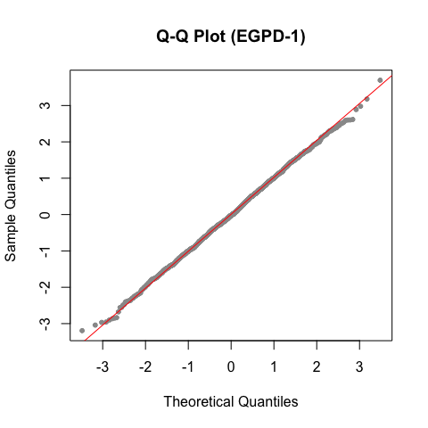
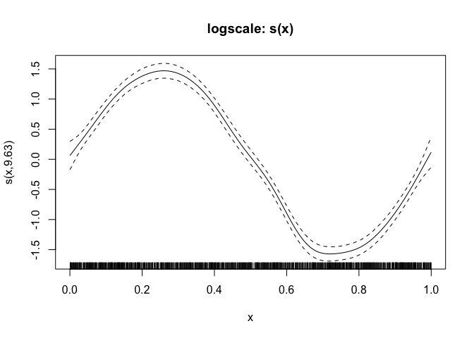
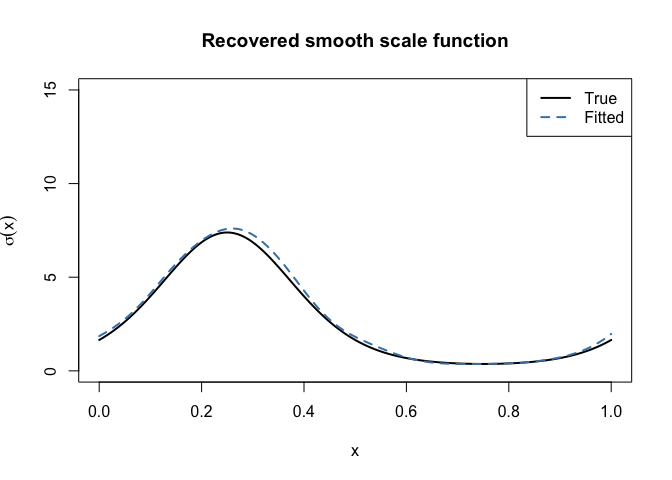
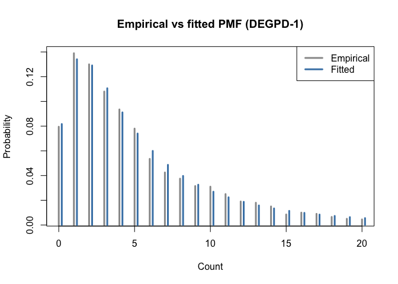
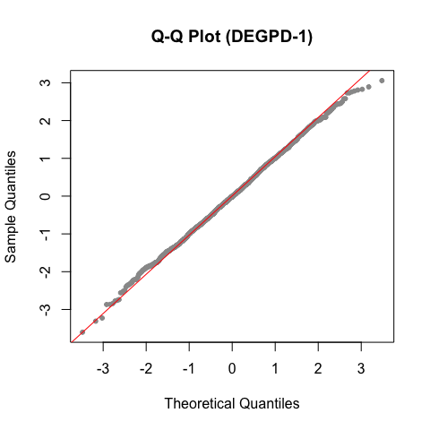
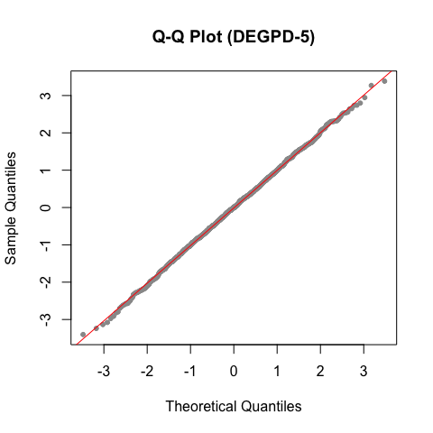
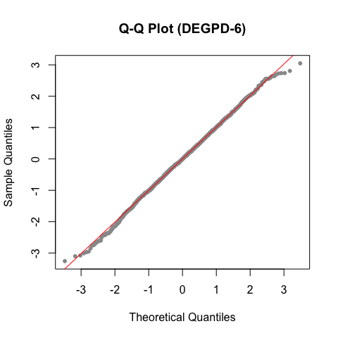
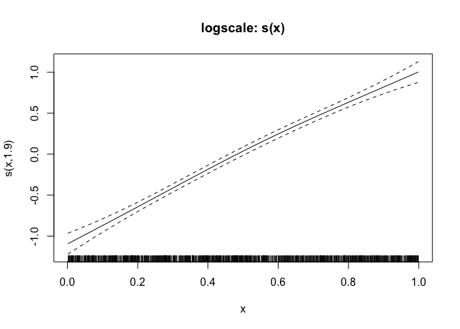
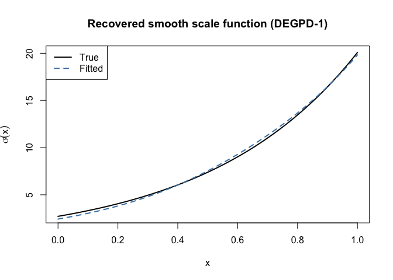
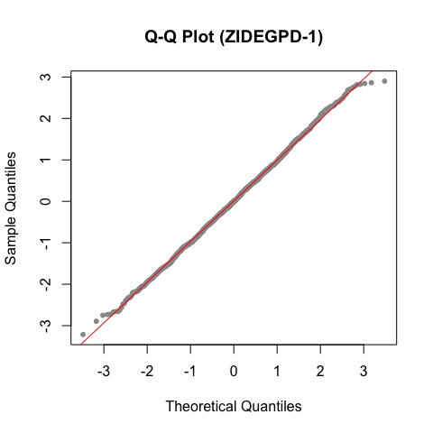

Simulation Examples
================

This vignette demonstrates the `egpd` package using simulated data.
Because the true parameters are known, we can verify that the models
recover them correctly. We also show how to fit models with
covariate-dependent parameters using smooth terms — the key advantage of
the GAM framework.

## 1. Continuous EGPD: intercept-only

We simulate from a continuous EGPD Model 1 with G(u) = u^kappa and fit
the model back.

``` r
library(egpd)
set.seed(1)

# True parameters
sigma_true <- 2
xi_true    <- 0.2
kappa_true <- 1.5

# Simulate
n <- 2000
y <- regpd(n, sigma = sigma_true, xi = xi_true, kappa = kappa_true, type = 1)
df <- data.frame(y = y, x = rep(1, n))

# Fit
fit <- egpd(list(lpsi = y ~ 1, xi = ~ 1, lkappa = ~ 1),
            data = df, family = "egpd", egpd.args = list(m = 1))
summary(fit)
```


    ** Parametric terms **

    logscale
                Estimate Std. Error t value Pr(>|t|)
    (Intercept)     0.68       0.06   10.92   <2e-16

    shape
                Estimate Std. Error t value Pr(>|t|)
    (Intercept)     0.22       0.03    7.24 2.25e-13

    logkappa
                Estimate Std. Error t value Pr(>|t|)
    (Intercept)     0.39       0.05    8.39   <2e-16

    ** Smooth terms **

Compare fitted parameters with truth on the response scale:

``` r
pars <- predict(fit, type = "response")[1, ]
truth <- c(scale = sigma_true, shape = xi_true, kappa = kappa_true)
cbind(true = truth, fitted = round(unlist(pars), 4))
```

          true fitted
    scale  2.0 1.9751
    shape  0.2 0.2197
    kappa  1.5 1.4738

A Q-Q plot of randomized quantile residuals confirms the fit:

``` r
set.seed(1)
r <- rqresid(fit)
qqnorm(r, main = "Q-Q Plot (EGPD-1)", pch = 20, col = "grey60")
qqline(r, col = "red")
```



## 2. Continuous EGPD: smooth covariate effect on scale

The GAM framework allows any parameter to depend on covariates through
smooth functions. Here the scale parameter varies with a covariate `x`
via a sinusoidal function, while the shape and kappa remain constant.

``` r
set.seed(42)
n <- 2000
x <- runif(n, 0, 1)

# Scale varies smoothly with x
sigma_x <- exp(0.5 + 1.5 * sin(2 * pi * x))
xi_true  <- 0.1
kappa_true <- 1.5

y <- regpd(n, sigma = sigma_x, xi = xi_true, kappa = kappa_true, type = 1)
df <- data.frame(y = y, x = x)
```

Fit with a smooth term on the log-scale parameter:

``` r
fit_smooth <- egpd(list(lpsi = y ~ s(x, k = 15), xi = ~ 1, lkappa = ~ 1),
                   data = df, family = "egpd", egpd.args = list(m = 1))
summary(fit_smooth)
```


    ** Parametric terms **

    logscale
                Estimate Std. Error t value Pr(>|t|)
    (Intercept)     0.56       0.06   10.11   <2e-16

    shape
                Estimate Std. Error t value Pr(>|t|)
    (Intercept)     0.08       0.03    2.87  0.00202

    logkappa
                Estimate Std. Error t value Pr(>|t|)
    (Intercept)     0.41       0.04    9.29   <2e-16

    ** Smooth terms **

    logscale
          edf max.df  Chi.sq Pr(>|t|)
    s(x) 9.63     14 2795.83   <2e-16

The `plot` method shows the estimated smooth effect. The true function
is `0.5 + 1.5 * sin(2*pi*x)` on the log-scale, centered around the
intercept.

``` r
plot(fit_smooth)
```



We can also extract the predicted scale on a fine grid and compare with
the truth.

``` r
xgrid <- data.frame(x = seq(0, 1, length = 200))
pred <- predict(fit_smooth, newdata = xgrid, type = "response")

plot(xgrid$x, exp(0.5 + 1.5 * sin(2 * pi * xgrid$x)), type = "l",
     lwd = 2, col = "black", ylim = c(0, 15),
     xlab = "x", ylab = expression(sigma(x)),
     main = "Recovered smooth scale function")
lines(xgrid$x, pred$scale, col = "steelblue", lwd = 2, lty = 2)
legend("topright", legend = c("True", "Fitted"),
       col = c("black", "steelblue"), lwd = 2, lty = c(1, 2))
```



## 3. Discrete DEGPD: parameter recovery

Simulate from a Discrete EGPD Model 1 and verify parameter recovery.

``` r
set.seed(2)
sigma_true <- 3
xi_true    <- 0.3
kappa_true <- 2.0

n <- 2000
y <- rdiscegpd(n, sigma = sigma_true, xi = xi_true, kappa = kappa_true,
               type = 1)
df <- data.frame(y = y, x = rep(1, n))

fit_d <- egpd(list(lsigma = y ~ 1, lxi = ~ 1, lkappa = ~ 1),
              data = df, family = "degpd", degpd.args = list(m = 1))
summary(fit_d)
```


    ** Parametric terms **

    logscale
                Estimate Std. Error t value Pr(>|t|)
    (Intercept)     1.14       0.08   13.77   <2e-16

    logshape
                Estimate Std. Error t value Pr(>|t|)
    (Intercept)    -1.13        0.1  -11.01   <2e-16

    logkappa
                Estimate Std. Error t value Pr(>|t|)
    (Intercept)     0.63       0.07    9.38   <2e-16

    ** Smooth terms **

``` r
pars_d <- predict(fit_d, type = "response")[1, ]
truth_d <- c(scale = sigma_true, shape = xi_true, kappa = kappa_true)
cbind(true = truth_d, fitted = round(unlist(pars_d), 4))
```

          true fitted
    scale  3.0 3.1256
    shape  0.3 0.3245
    kappa  2.0 1.8724

Compare fitted and empirical PMFs:

``` r
xvals <- 0:20
emp_pmf <- tabulate(y + 1, nbins = max(xvals) + 1) / n
fit_pmf <- ddiscegpd(xvals, sigma = pars_d$scale[1], xi = pars_d$shape[1],
                     kappa = pars_d$kappa[1], type = 1)

plot(xvals, emp_pmf[seq_along(xvals)], type = "h", lwd = 3, col = "grey60",
     main = "Empirical vs fitted PMF (DEGPD-1)",
     xlab = "Count", ylab = "Probability")
lines(xvals + 0.2, fit_pmf, type = "h", lwd = 3, col = "steelblue")
legend("topright", legend = c("Empirical", "Fitted"),
       col = c("grey60", "steelblue"), lwd = 3)
```



Q-Q plot of randomized quantile residuals:

``` r
set.seed(1)
r_d <- rqresid(fit_d)
qqnorm(r_d, main = "Q-Q Plot (DEGPD-1)", pch = 20, col = "grey60")
qqline(r_d, col = "red")
```



## 3b. Discrete DEGPD Model 2: parameter recovery

Model 2 uses a mixture of two power transformations: G(u) = p·u^kappa1 +
(1-p)·u^kappa2. We simulate from `rdiscegpd()` with `type = 6` and
recover the five parameters.

``` r
set.seed(22)
sigma_true <- 3
xi_true    <- 0.3
kappa1_true <- 1.5
kappa2_true <- 3.0
prob_true   <- 0.6

n <- 2000
y <- rdiscegpd(n, sigma = sigma_true, xi = xi_true, kappa = kappa1_true,
               delta = kappa2_true, prob = prob_true, type = 6)
df <- data.frame(y = y, x = rep(1, n))

cat("Range:", range(y), "\n")
```

    Range: 0 150 

``` r
cat("Mean:", mean(y), "\n")
```

    Mean: 6.5425 

``` r
fit_d2 <- egpd(list(lsigma = y ~ 1, lxi = ~ 1, lkappa1 = ~ 1, ldkappa = ~ 1,
                    logitp = ~ 1),
               data = df, family = "degpd", degpd.args = list(m = 2))
summary(fit_d2)
```


    ** Parametric terms **

    logscale
                Estimate Std. Error t value Pr(>|t|)
    (Intercept)     0.23       0.36    0.65    0.259

    logshape
                Estimate Std. Error t value Pr(>|t|)
    (Intercept)    -0.84        0.1   -8.79   <2e-16

    logkappa1
                Estimate Std. Error t value Pr(>|t|)
    (Intercept)     0.87       0.26     3.3 0.000492

    logdkappa
                Estimate Std. Error t value Pr(>|t|)
    (Intercept)     2.15        0.6    3.57 0.000179

    logitp
                Estimate Std. Error t value Pr(>|t|)
    (Intercept)        0       0.28       0    0.499

    ** Smooth terms **

Compare fitted parameters with truth on the response scale. Note the
reparameterization: kappa2 = kappa1 + exp(ldkappa), so the model
estimates `ldkappa` (log of the difference) rather than kappa2 directly.

``` r
pars_d2 <- predict(fit_d2, type = "response")[1, ]
truth_d2 <- c(scale = sigma_true, shape = xi_true, kappa1 = kappa1_true,
              kappa2 = kappa2_true, p = prob_true)
fitted_d2 <- round(unlist(pars_d2), 4)
cbind(true = truth_d2, fitted = fitted_d2)
```

           true fitted
    scale   3.0 1.2624
    shape   0.3 0.4299
    kappa1  1.5 2.3865
    kappa2  3.0 8.5558
    p       0.6 0.4998

Q-Q plot of randomized quantile residuals for the Model 2 fit:

``` r
set.seed(1)
r_d2 <- rqresid(fit_d2)
qqnorm(r_d2, main = "Q-Q Plot (DEGPD-2)", pch = 20, col = "grey60")
qqline(r_d2, col = "red")
```


## 3c. Discrete DEGPD Model 5: truncated normal parameter recovery

Model 5 uses a truncated normal G-transformation. We simulate and verify
parameter recovery.

``` r
set.seed(55)
sigma_true <- 3
xi_true    <- 0.3
kappa_true <- 2.0

n <- 2000
y <- rdiscegpd(n, sigma = sigma_true, xi = xi_true, kappa = kappa_true,
               type = 2)
df <- data.frame(y = y, x = rep(1, n))

cat("Range:", range(y), "\n")
```

    Range: 0 120 

``` r
cat("Mean:", mean(y), "\n")
```

    Mean: 4.934 

``` r
fit_d5 <- egpd(list(lsigma = y ~ 1, lxi = ~ 1, lkappa = ~ 1),
               data = df, family = "degpd", degpd.args = list(m = 5))
summary(fit_d5)
```


    ** Parametric terms **

    logscale
                Estimate Std. Error t value Pr(>|t|)
    (Intercept)     1.13       0.09   13.24   <2e-16

    logshape
                Estimate Std. Error t value Pr(>|t|)
    (Intercept)    -1.15       0.12   -9.55   <2e-16

    logkappa
                Estimate Std. Error t value Pr(>|t|)
    (Intercept)     0.52       0.26       2   0.0226

    ** Smooth terms **

``` r
pars_d5 <- predict(fit_d5, type = "response")[1, ]
truth_d5 <- c(scale = sigma_true, shape = xi_true, kappa = kappa_true)
cbind(true = truth_d5, fitted = round(unlist(pars_d5), 4))
```

          true fitted
    scale  3.0 3.0847
    shape  0.3 0.3169
    kappa  2.0 1.6820

``` r
set.seed(1)
r_d5 <- rqresid(fit_d5)
qqnorm(r_d5, main = "Q-Q Plot (DEGPD-5)", pch = 20, col = "grey60")
qqline(r_d5, col = "red")
```



## 3d. Discrete DEGPD Model 6: truncated beta parameter recovery

Model 6 uses a truncated beta G-transformation. We simulate and verify
parameter recovery.

``` r
set.seed(66)
sigma_true <- 3
xi_true    <- 0.3
kappa_true <- 2.0

n <- 2000
y <- rdiscegpd(n, sigma = sigma_true, xi = xi_true, kappa = kappa_true,
               type = 3)
df <- data.frame(y = y, x = rep(1, n))

cat("Range:", range(y), "\n")
```

    Range: 0 97 

``` r
cat("Mean:", mean(y), "\n")
```

    Mean: 5.0585 

``` r
fit_d6 <- egpd(list(lsigma = y ~ 1, lxi = ~ 1, lkappa = ~ 1),
               data = df, family = "degpd", degpd.args = list(m = 6))
summary(fit_d6)
```


    ** Parametric terms **

    logscale
                Estimate Std. Error t value Pr(>|t|)
    (Intercept)     1.01       0.07   15.12   <2e-16

    logshape
                Estimate Std. Error t value Pr(>|t|)
    (Intercept)    -1.15        0.1  -11.11   <2e-16

    logkappa
                Estimate Std. Error t value Pr(>|t|)
    (Intercept)     0.85       0.08   11.32   <2e-16

    ** Smooth terms **

``` r
pars_d6 <- predict(fit_d6, type = "response")[1, ]
truth_d6 <- c(scale = sigma_true, shape = xi_true, kappa = kappa_true)
cbind(true = truth_d6, fitted = round(unlist(pars_d6), 4))
```

          true fitted
    scale  3.0 2.7320
    shape  0.3 0.3178
    kappa  2.0 2.3486

``` r
set.seed(1)
r_d6 <- rqresid(fit_d6)
```

    Warning in qnorm(u): NaNs produced

``` r
qqnorm(r_d6, main = "Q-Q Plot (DEGPD-6)", pch = 20, col = "grey60")
qqline(r_d6, col = "red")
```



## 4. Discrete DEGPD: smooth covariate effect

Now simulate discrete data where the scale varies with a covariate.

``` r
set.seed(7)
n <- 2000
x <- runif(n, 0, 1)
sigma_x <- exp(1 + 2 * x)
xi_true  <- 0.3
kappa_true <- 1.5

y <- rdiscegpd(n, sigma = sigma_x, xi = xi_true, kappa = kappa_true, type = 1)
df <- data.frame(y = y, x = x)
```

``` r
fit_ds <- egpd(list(lsigma = y ~ s(x, k = 10), lxi = ~ 1, lkappa = ~ 1),
               data = df, family = "degpd", degpd.args = list(m = 1))
summary(fit_ds)
```


    ** Parametric terms **

    logscale
                Estimate Std. Error t value Pr(>|t|)
    (Intercept)     1.98       0.07    27.9   <2e-16

    logshape
                Estimate Std. Error t value Pr(>|t|)
    (Intercept)    -1.11        0.1  -11.41   <2e-16

    logkappa
                Estimate Std. Error t value Pr(>|t|)
    (Intercept)     0.38       0.05    7.16 4.17e-13

    ** Smooth terms **

    logscale
         edf max.df Chi.sq Pr(>|t|)
    s(x) 1.9      9 621.91   <2e-16

``` r
plot(fit_ds)
```



Compare fitted and true scale on a grid:

``` r
xgrid <- data.frame(x = seq(0, 1, length = 200))
pred_ds <- predict(fit_ds, newdata = xgrid, type = "response")

plot(xgrid$x, exp(1 + 2 * xgrid$x), type = "l", lwd = 2, col = "black",
     xlab = "x", ylab = expression(sigma(x)),
     main = "Recovered smooth scale function (DEGPD-1)")
lines(xgrid$x, pred_ds$scale, col = "steelblue", lwd = 2, lty = 2)
legend("topleft", legend = c("True", "Fitted"),
       col = c("black", "steelblue"), lwd = 2, lty = c(1, 2))
```



## 5. Zero-inflated DEGPD: estimating zero-inflation

Simulate from a ZIDEGPD with known zero-inflation probability and verify
the model recovers it.

``` r
set.seed(3)
sigma_true <- 3
xi_true    <- 0.3
kappa_true <- 1.5
pi_true    <- 0.3

n <- 2000
y <- rzidiscegpd(n, pi = pi_true, sigma = sigma_true, xi = xi_true,
                 kappa = kappa_true, type = 1)
df <- data.frame(y = y, x = rep(1, n))

cat("Proportion of zeros:", mean(y == 0), "\n")
```

    Proportion of zeros: 0.398 

``` r
cat("Expected proportion: pi + (1-pi)*P(Y=0) =",
    round(pi_true + (1 - pi_true) * ddiscegpd(0, sigma = sigma_true,
          xi = xi_true, kappa = kappa_true, type = 1), 3), "\n")
```

    Expected proportion: pi + (1-pi)*P(Y=0) = 0.399 

``` r
fit_zi <- egpd(list(lsigma = y ~ 1, lxi = ~ 1, lkappa = ~ 1, logitpi = ~ 1),
               data = df, family = "zidegpd", zidegpd.args = list(m = 1))
summary(fit_zi)
```


    ** Parametric terms **

    logscale
                Estimate Std. Error t value Pr(>|t|)
    (Intercept)     1.12       0.17    6.53 3.22e-11

    logshape
                Estimate Std. Error t value Pr(>|t|)
    (Intercept)    -1.37       0.21   -6.53 3.22e-11

    logkappa
                Estimate Std. Error t value Pr(>|t|)
    (Intercept)     0.47       0.22    2.17   0.0149

    logitpi
                Estimate Std. Error t value Pr(>|t|)
    (Intercept)    -0.78       0.13   -6.16 3.56e-10

    ** Smooth terms **

``` r
pars_zi <- predict(fit_zi, type = "response")[1, ]
truth_zi <- c(scale = sigma_true, shape = xi_true, kappa = kappa_true,
              pi = pi_true)
cbind(true = truth_zi, fitted = round(unlist(pars_zi), 4))
```

          true fitted
    scale  3.0 3.0684
    shape  0.3 0.2551
    kappa  1.5 1.5995
    pi     0.3 0.3141

Q-Q plot of randomized quantile residuals for the ZIDEGPD fit:

``` r
set.seed(1)
r_zi <- rqresid(fit_zi)
qqnorm(r_zi, main = "Q-Q Plot (ZIDEGPD-1)", pch = 20, col = "grey60")
qqline(r_zi, col = "red")
```



## 6. Model selection: DEGPD vs ZIDEGPD

A key question in practice is whether zero-inflation is needed. We fit
both a DEGPD and a ZIDEGPD to the zero-inflated data above and compare
by AIC.

``` r
fit_nozi <- egpd(list(lsigma = y ~ 1, lxi = ~ 1, lkappa = ~ 1),
                 data = df, family = "degpd", degpd.args = list(m = 1))

data.frame(
  Model = c("DEGPD-1 (no ZI)", "ZIDEGPD-1"),
  logLik = c(logLik(fit_nozi), logLik(fit_zi)),
  AIC = c(AIC(fit_nozi), AIC(fit_zi))
)
```

                Model    logLik      AIC
    1 DEGPD-1 (no ZI) -4555.870 9117.741
    2       ZIDEGPD-1 -4544.395 9096.789

The ZIDEGPD model correctly fits better, confirming that zero-inflation
is present in the data.

## 7. Quantile prediction

The `predict` method with `type = "quantile"` computes quantile
estimates from any fitted model.

``` r
probs <- c(0.5, 0.9, 0.95, 0.99)

# Theoretical quantiles from the known distribution
true_q <- qzidiscegpd(probs, pi = pi_true, sigma = sigma_true,
                       xi = xi_true, kappa = kappa_true, type = 1)

# Fitted quantiles
fit_q <- predict(fit_zi, type = "quantile", prob = probs)

data.frame(prob = probs,
           true = true_q,
           fitted = unlist(fit_q[1, ]),
           empirical = quantile(y, probs))
```

           prob true fitted empirical
    q:0.5  0.50    1      1      1.00
    q:0.9  0.90   10      9     10.00
    q:0.95 0.95   14     14     14.00
    q:0.99 0.99   30     27     27.01
