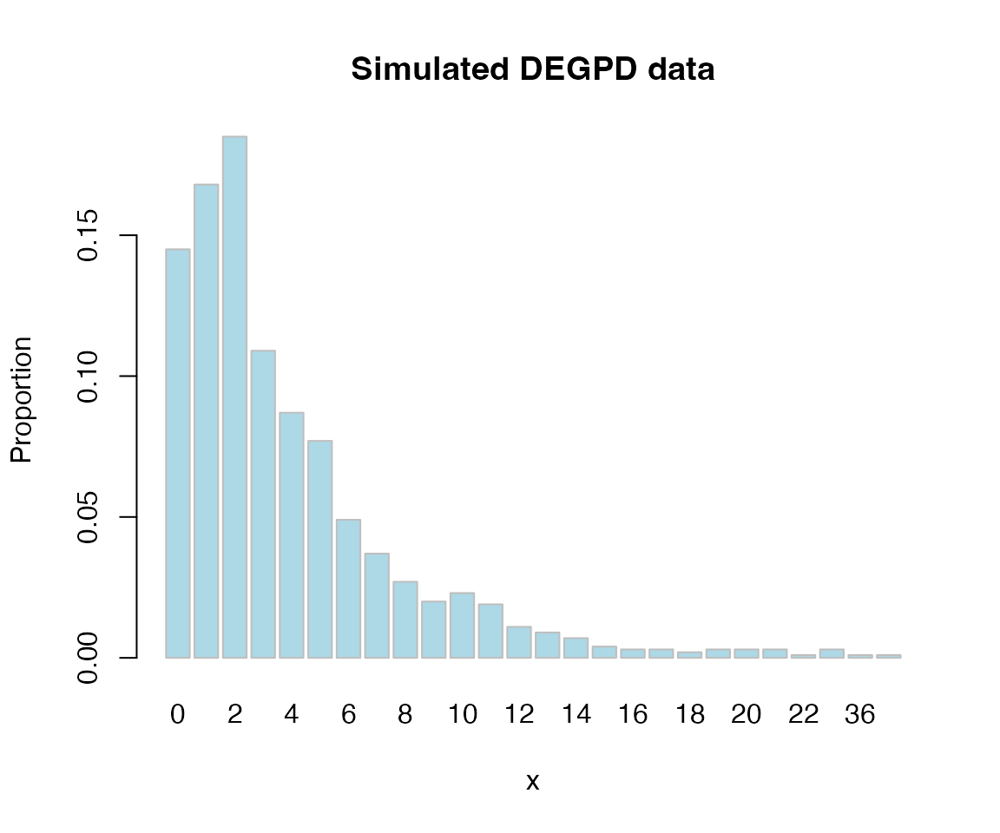
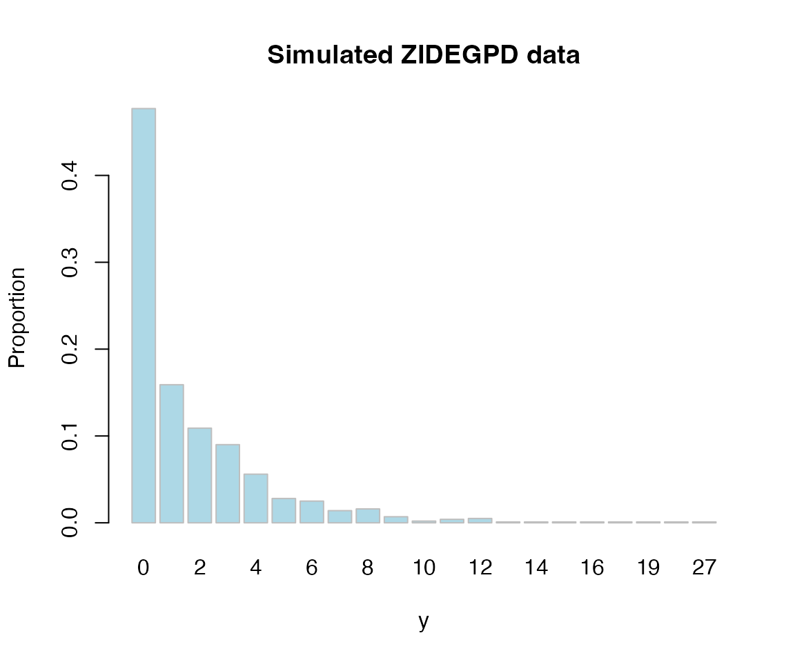
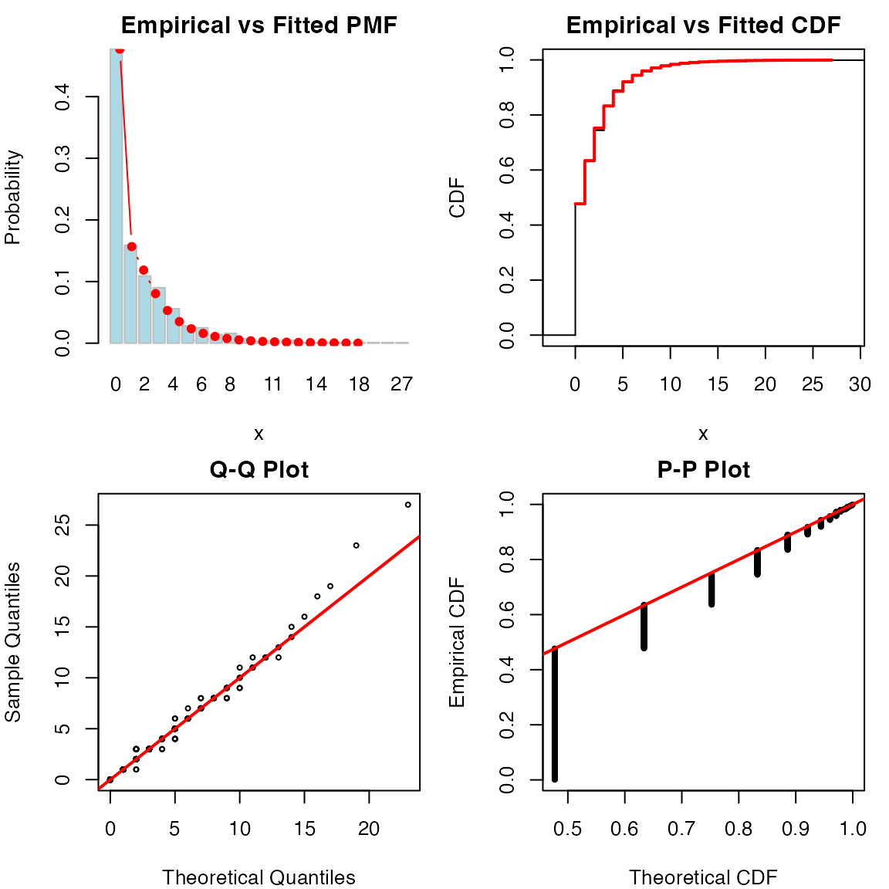
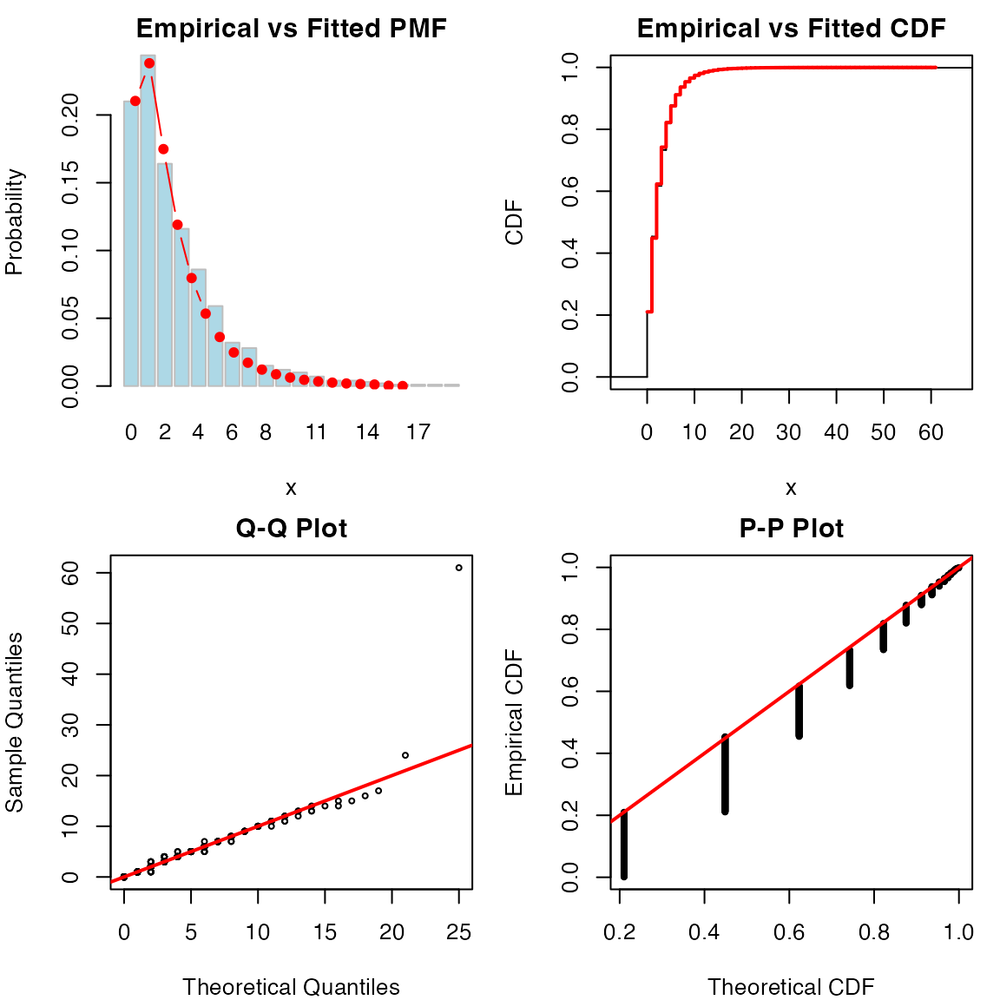

# Fitting Discrete Distributions with fitegpd

The [`fitegpd()`](https://sdwfrost.github.io/egpd/reference/fitegpd.md)
function supports two discrete distribution families for fitting
non-negative integer (count) data:

1.  **Discrete EGPD** (`family = "degpd"`) — for counts without excess
    zeros
2.  **Zero-Inflated Discrete EGPD** (`family = "zidegpd"`) — for counts
    with more zeros than the base model can accommodate

Both discretize the continuous EGPD by placing the probability mass of
each integer $`k`$ at
$`P(X = k) = F_{\mathrm{EGPD}}(k+1) - F_{\mathrm{EGPD}}(k)`$, inheriting
the flexible body and Pareto tail of the continuous model. This makes
them natural alternatives to the Poisson, negative binomial, or
Conway–Maxwell–Poisson for heavy-tailed or over-dispersed count data.

## 1. Discrete EGPD

### The model

The discrete EGPD (DEGPD) has PMF

``` math
P(X = k) = G\!\bigl(H(k+1)\bigr) - G\!\bigl(H(k)\bigr), \qquad k = 0, 1, 2, \ldots
```

where $`H`$ is the standard GPD CDF and $`G`$ is the EGPD transformation
function. As with the continuous EGPD, the `type` argument selects the
parametric form of $`G`$.

### Simulating and fitting

We generate data from a DEGPD Type 1 model and fit it back.

``` r

library(egpd)
set.seed(1)

sigma_true <- 3
xi_true    <- 0.1
kappa_true <- 1.5

x <- rdiscegpd(1000, sigma = sigma_true, xi = xi_true,
               kappa = kappa_true, type = 1)

cat("Range:", range(x), "\n")
#> Range: 0 51
cat("Mean:", round(mean(x), 2), "  Var:", round(var(x), 2), "\n")
#> Mean: 3.89   Var: 19
cat("Proportion zeros:", mean(x == 0), "\n")
#> Proportion zeros: 0.145
```

``` r

barplot(table(x) / length(x), main = "Simulated DEGPD data",
        xlab = "x", ylab = "Proportion", col = "lightblue", border = "grey")
```



``` r

fit_degpd <- fitegpd(x, type = 1, family = "degpd")
summary(fit_degpd)
#> Fitting of the distribution 'degpd' (type 1)
#> Method: mle
#> 
#> Estimated parameters:
#>       Estimate Std. Error z value Pr(>|z|)    
#> sigma  2.79011    0.27440  10.168  < 2e-16 ***
#> xi     0.14362    0.04309   3.333 0.000859 ***
#> kappa  1.59145    0.13492  11.796  < 2e-16 ***
#> ---
#> Signif. codes:  0 '***' 0.001 '**' 0.01 '*' 0.05 '.' 0.1 ' ' 1
#> 
#> Convergence:  successful 
#> Loglikelihood:  -2457.38   AIC:  4920.77   BIC:  4935.49 
#> Number of observations:  1000
```

### Parameter recovery

``` r

truth <- c(sigma = sigma_true, xi = xi_true, kappa = kappa_true)
est <- fit_degpd$estimate
cbind(true = truth, estimate = round(est, 4),
      SE = round(fit_degpd$sd, 4))
#>       true estimate     SE
#> sigma  3.0   2.7901 0.2744
#> xi     0.1   0.1436 0.0431
#> kappa  1.5   1.5915 0.1349
```

### Diagnostics

The diagnostic plot for discrete families shows the empirical PMF with
fitted probabilities (panel 1), a step-function CDF comparison (panel
2), and Q-Q and P-P plots.

``` r

plot(fit_degpd)
```


### Comparing types by AIC

Different G-transformation types suit different data shapes. We can use
AIC to select among them:

``` r

aic_table <- data.frame(
  type = c(1, 4, 5),
  AIC = c(
    AIC(fitegpd(x, type = 1, family = "degpd")),
    AIC(fitegpd(x, type = 4, family = "degpd")),
    AIC(fitegpd(x, type = 5, family = "degpd"))
  )
)
aic_table
#>   type      AIC
#> 1    1 4920.769
#> 2    4 4921.978
#> 3    5 4922.722
```

### Confidence intervals

``` r

confint(fit_degpd)
#>            2.5 %    97.5 %
#> sigma 2.25229832 3.3279173
#> xi    0.05916484 0.2280755
#> kappa 1.32702000 1.8558842
```

### Fixing parameters

As with continuous fits, individual parameters can be fixed at known
values:

``` r

fit_fix <- fitegpd(x, type = 1, family = "degpd",
                    fix.arg = list(xi = 0.1))
summary(fit_fix)
#> Fitting of the distribution 'degpd' (type 1)
#> Method: mle
#> 
#> Estimated parameters:
#>       Estimate Std. Error z value Pr(>|z|)    
#> sigma  3.03816    0.14717   20.64   <2e-16 ***
#> kappa  1.49640    0.08492   17.62   <2e-16 ***
#> ---
#> Signif. codes:  0 '***' 0.001 '**' 0.01 '*' 0.05 '.' 0.1 ' ' 1
#> 
#> Fixed parameters:
#>    Value
#> xi   0.1
#> 
#> Convergence:  successful 
#> Loglikelihood:  -2457.94   AIC:  4919.87   BIC:  4929.69 
#> Number of observations:  1000
```

## 2. Zero-Inflated Discrete EGPD

### The model

Many count datasets have more zeros than any standard count model can
explain — e.g. the number of insurance claims (many policyholders file
none), species counts (many sites have zero individuals), or disease
counts (many days with no cases). The zero-inflated discrete EGPD
(ZIDEGPD) handles this by mixing a point mass at zero with the DEGPD:

``` math
P(X = k) = \begin{cases}
\pi + (1-\pi)\,P_{\mathrm{DEGPD}}(X=0) & k = 0 \\
(1-\pi)\,P_{\mathrm{DEGPD}}(X=k) & k \ge 1
\end{cases}
```

where $`\pi \in (0,1)`$ is the zero-inflation probability. The overall
zero probability is $`\pi + (1-\pi)\,P_{\mathrm{DEGPD}}(0)`$, which is
always larger than $`P_{\mathrm{DEGPD}}(0)`$ alone.

### Simulating and fitting

``` r

set.seed(42)

sigma_true <- 2
xi_true    <- 0.1
kappa_true <- 1.5
pi_true    <- 0.3

y <- rzidiscegpd(1000, pi = pi_true, sigma = sigma_true,
                  xi = xi_true, kappa = kappa_true, type = 1)

cat("Range:", range(y), "\n")
#> Range: 0 27
cat("Mean:", round(mean(y), 2), "  Var:", round(var(y), 2), "\n")
#> Mean: 1.72   Var: 7.42
cat("Proportion zeros:", mean(y == 0), "\n")
#> Proportion zeros: 0.477
```

The zero proportion should be notably higher than for the non-inflated
model because of the extra $`\pi = 0.3`$ point mass.

``` r

barplot(table(y) / length(y), main = "Simulated ZIDEGPD data",
        xlab = "y", ylab = "Proportion", col = "lightblue", border = "grey")
```



``` r

fit_zi <- fitegpd(y, type = 1, family = "zidegpd")
summary(fit_zi)
#> Fitting of the distribution 'zidegpd' (type 1)
#> Method: mle
#> 
#> Estimated parameters:
#>       Estimate Std. Error z value Pr(>|z|)    
#> sigma  1.75242    0.45527   3.849 0.000119 ***
#> xi     0.15798    0.07358   2.147 0.031789 *  
#> kappa  1.98004    0.83642   2.367 0.017919 *  
#> pi     0.36206    0.05961   6.074 1.25e-09 ***
#> ---
#> Signif. codes:  0 '***' 0.001 '**' 0.01 '*' 0.05 '.' 0.1 ' ' 1
#> 
#> Convergence:  successful 
#> Loglikelihood:  -1745.38   AIC:  3498.76   BIC:  3518.39 
#> Number of observations:  1000
```

### Parameter recovery

``` r

truth <- c(sigma = sigma_true, xi = xi_true,
           kappa = kappa_true, pi = pi_true)
est <- fit_zi$estimate
cbind(true = truth, estimate = round(est, 4),
      SE = round(fit_zi$sd, 4))
#>       true estimate     SE
#> sigma  2.0   1.7524 0.4553
#> xi     0.1   0.1580 0.0736
#> kappa  1.5   1.9800 0.8364
#> pi     0.3   0.3621 0.0596
```

### Diagnostics

``` r

plot(fit_zi)
```



### Confidence intervals

``` r

confint(fit_zi)
#>            2.5 %    97.5 %
#> sigma 0.86010370 2.6447462
#> xi    0.01376614 0.3022005
#> kappa 0.34069321 3.6193960
#> pi    0.24522643 0.4788926
```

## 3. Comparing DEGPD and ZIDEGPD

When faced with zero-heavy count data, a natural question is whether the
zero inflation is needed or whether the base DEGPD already accounts for
the zeros adequately. We can compare the two models by AIC.

### Fitting both models to zero-inflated data

``` r

fit_no_zi <- fitegpd(y, type = 1, family = "degpd")
fit_with_zi <- fit_zi  # already fitted above

cat("DEGPD AIC:   ", AIC(fit_no_zi), "\n")
#> DEGPD AIC:    3503.567
cat("ZIDEGPD AIC: ", AIC(fit_with_zi), "\n")
#> ZIDEGPD AIC:  3498.756
```

Since the data were generated with $`\pi = 0.3`$, the zero-inflated
model should have a substantially lower AIC.

### Fitting both models to non-inflated data

Conversely, when the data have no excess zeros, the extra $`\pi`$
parameter should not help:

``` r

fit_degpd_on_x <- fit_degpd  # fitted to non-inflated x above
fit_zi_on_x <- fitegpd(x, type = 1, family = "zidegpd")

cat("DEGPD AIC:   ", AIC(fit_degpd_on_x), "\n")
#> DEGPD AIC:    4920.769
cat("ZIDEGPD AIC: ", AIC(fit_zi_on_x), "\n")
#> ZIDEGPD AIC:  4922.401
cat("Estimated pi:", round(fit_zi_on_x$estimate["pi"], 4), "\n")
#> Estimated pi: 0.0278
```

The estimated $`\pi`$ should be near zero and the ZIDEGPD AIC slightly
higher (penalised for the extra parameter).

## 4. Higher-order types

Types 5 and 6 provide additional flexibility. Type 5 has both $`\delta`$
and $`\kappa`$ parameters; Type 6 adds a mixing probability $`p`$.

``` r

set.seed(99)
x5 <- rdiscegpd(1000, sigma = 2, xi = 0.1, delta = 1.2,
                 kappa = 1.8, type = 5)
fit5 <- fitegpd(x5, type = 5, family = "degpd")
summary(fit5)
#> Fitting of the distribution 'degpd' (type 5)
#> Method: mle
#> 
#> Estimated parameters:
#>       Estimate Std. Error z value Pr(>|z|)    
#> sigma   1.6361     0.6106   2.679  0.00738 ** 
#> xi      0.1559     0.0392   3.976 7.01e-05 ***
#> delta   0.4117     0.9827   0.419  0.67523    
#> kappa   1.6597     0.1586  10.464  < 2e-16 ***
#> ---
#> Signif. codes:  0 '***' 0.001 '**' 0.01 '*' 0.05 '.' 0.1 ' ' 1
#> 
#> Convergence:  successful 
#> Loglikelihood:  -2117.78   AIC:  4243.56   BIC:  4263.19 
#> Number of observations:  1000
```

``` r

plot(fit5)
```



## 5. Practical guidelines

**Choosing between DEGPD and ZIDEGPD.** Start with `family = "degpd"`.
If the diagnostic plots show the model underestimates the zero
probability, refit with `family = "zidegpd"` and compare by AIC.

**Choosing the type.** Fit several types and compare AIC. Types 1 and 4
have three parameters and are good defaults. Type 5 (four parameters)
and Type 6 (five parameters) offer more flexibility but need larger
samples.

**Starting values.** The automatic starting values work well in most
cases. For difficult datasets (e.g. very heavy tails), supply custom
start values via `start = list(sigma = ..., xi = ...)`.

**Fixed parameters.** Use `fix.arg` when external information is
available — e.g. `fix.arg = list(xi = 0)` for an exponential tail.

## Summary

| Family | Parameters | Zero mechanism | Use case |
|----|----|----|----|
| `"degpd"` | $`\sigma, \xi`$ + type-specific | Natural zeros from DEGPD | Standard count data |
| `"zidegpd"` | $`\sigma, \xi`$ + type-specific + $`\pi`$ | Extra point mass at zero | Counts with excess zeros |

Both families:

- Return S3 objects of class `"fitegpd"` with the same interface
  (`summary`, `plot`, `AIC`, `confint`, `coef`, `vcov`, `logLik`)
- Support `fix.arg` for fixing parameters at known values
- Estimate standard errors via the delta method on the Hessian
- Provide four-panel diagnostic plots tailored for discrete data (bar
  plots for PMF, step functions for CDF)
