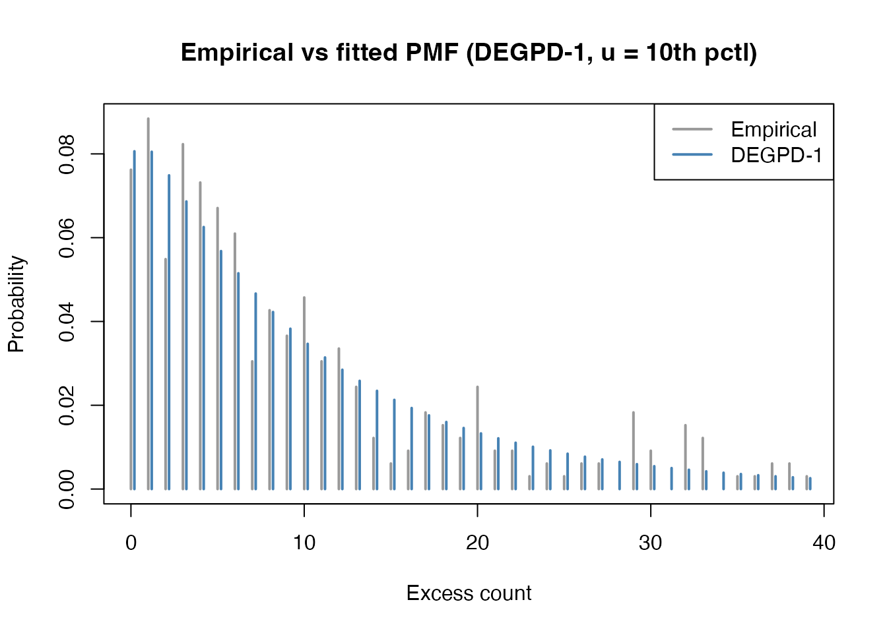
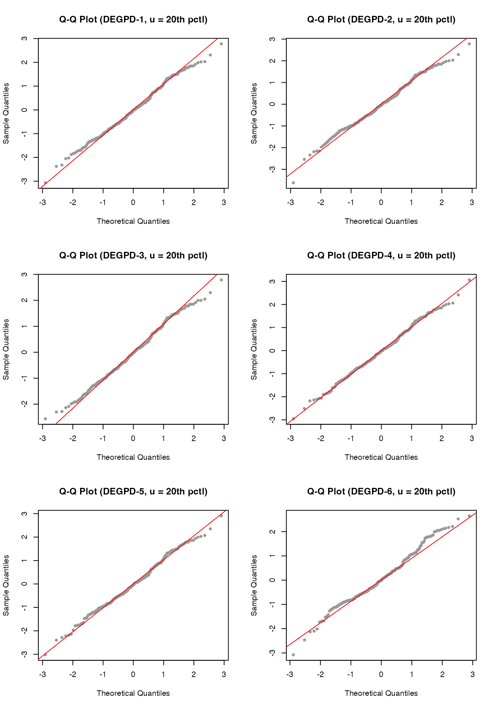

# Threshold Exceedance Modeling with DEGPD

This vignette demonstrates threshold exceedance modeling using the
Discrete Extended Generalized Pareto Distribution (DEGPD). When
modelling discrete extreme values, observations above a threshold are
extracted, centered, and fitted with a DEGPD. We illustrate the approach
with gaming and betting offense counts from New South Wales, Australia.

## Data

``` r

library(egpd)
data(nsw_offenses)
str(nsw_offenses)
#> 'data.frame':    342 obs. of  1 variable:
#>  $ offenses: int  3 3 6 8 4 7 5 2 3 4 ...
```

``` r

d <- nsw_offenses$offenses
plot(table(d), main = "Gaming and betting offenses (NSW)",
     xlab = "Number of offenses", ylab = "Frequency")
```


``` r

cat("n =", length(d), " range:", range(d), "\n")
#> n = 342  range: 0 88
```

## Threshold selection

In extreme value analysis, we model only the observations that exceed a
chosen threshold. The choice of threshold involves a bias–variance
trade-off: a higher threshold gives better model fit but fewer
observations.

We demonstrate two threshold choices: the 10th and 20th percentiles.

### Threshold at 10th percentile

``` r

u10 <- floor(quantile(d, 0.10))
cat("Threshold u (10th percentile):", u10, "\n")
#> Threshold u (10th percentile): 1
y10 <- d[d >= u10] - u10
cat("Exceedances: n =", length(y10), "\n")
#> Exceedances: n = 328

hist(y10, breaks = 50, col = "lightblue", border = "white",
     main = paste0("Threshold exceedances (u = ", u10, ")"),
     xlab = "Excess count", ylab = "Frequency")
```


### Fitting DEGPD models to the 10th-percentile exceedances

``` r

df10 <- data.frame(y = y10, x = rep(1, length(y10)))

fit10_m1 <- egpd(list(lsigma = y ~ 1, lxi = ~ 1, lkappa = ~ 1),
                 data = df10, family = "degpd", degpd.args = list(m = 1))

fit10_m2 <- egpd(list(lsigma = y ~ 1, lxi = ~ 1, lkappa1 = ~ 1, ldkappa = ~ 1,
                      logitp = ~ 1),
                 data = df10, family = "degpd", degpd.args = list(m = 2))
#> Final Hessian of negative penalized log-likelihood not numerically positive definite.

fit10_m3 <- egpd(list(lsigma = y ~ 1, lxi = ~ 1, ldelta = ~ 1),
                 data = df10, family = "degpd", degpd.args = list(m = 3))

fit10_m4 <- egpd(list(lsigma = y ~ 1, lxi = ~ 1, ldelta = ~ 1, lkappa = ~ 1),
                 data = df10, family = "degpd", degpd.args = list(m = 4))

fit10_m5 <- egpd(list(lsigma = y ~ 1, lxi = ~ 1, lkappa = ~ 1),
                 data = df10, family = "degpd", degpd.args = list(m = 5))

fit10_m6 <- egpd(list(lsigma = y ~ 1, lxi = ~ 1, lkappa = ~ 1),
                 data = df10, family = "degpd", degpd.args = list(m = 6))

aic10 <- data.frame(
  Model = c("DEGPD-1", "DEGPD-2", "DEGPD-3", "DEGPD-4", "DEGPD-5", "DEGPD-6"),
  npar = c(3, 5, 3, 4, 3, 3),
  logLik = c(logLik(fit10_m1), logLik(fit10_m2), logLik(fit10_m3),
             logLik(fit10_m4), logLik(fit10_m5), logLik(fit10_m6)),
  AIC = c(AIC(fit10_m1), AIC(fit10_m2), AIC(fit10_m3),
          AIC(fit10_m4), AIC(fit10_m5), AIC(fit10_m6))
)
aic10
#>     Model npar    logLik      AIC
#> 1 DEGPD-1    3 -1126.689 2259.378
#> 2 DEGPD-2    5 -1128.527 2267.054
#> 3 DEGPD-3    3 -1126.477 2258.955
#> 4 DEGPD-4    4 -1126.537 2261.075
#> 5 DEGPD-5    3 -1126.936 2259.872
#> 6 DEGPD-6    3 -1126.736 2259.472
```

``` r

summary(fit10_m1)
#> 
#> ** Parametric terms **
#> 
#> logscale
#>             Estimate Std. Error t value Pr(>|t|)
#> (Intercept)     2.26       0.17   13.38   <2e-16
#> 
#> logshape
#>             Estimate Std. Error t value Pr(>|t|)
#> (Intercept)    -2.23       0.84   -2.66  0.00391
#> 
#> logkappa
#>             Estimate Std. Error t value Pr(>|t|)
#> (Intercept)     0.08       0.12     0.7    0.243
#> 
#> ** Smooth terms **
```

### Threshold at 20th percentile

``` r

u20 <- floor(quantile(d, 0.20))
cat("Threshold u (20th percentile):", u20, "\n")
#> Threshold u (20th percentile): 3
y20 <- d[d >= u20] - u20
cat("Exceedances: n =", length(y20), "\n")
#> Exceedances: n = 274

hist(y20, breaks = 50, col = "lightblue", border = "white",
     main = paste0("Threshold exceedances (u = ", u20, ")"),
     xlab = "Excess count", ylab = "Frequency")
```


``` r

df20 <- data.frame(y = y20, x = rep(1, length(y20)))

fit20_m1 <- egpd(list(lsigma = y ~ 1, lxi = ~ 1, lkappa = ~ 1),
                 data = df20, family = "degpd", degpd.args = list(m = 1))

fit20_m2 <- egpd(list(lsigma = y ~ 1, lxi = ~ 1, lkappa1 = ~ 1, ldkappa = ~ 1,
                      logitp = ~ 1),
                 data = df20, family = "degpd", degpd.args = list(m = 2))
#> Final Hessian of negative penalized log-likelihood not numerically positive definite.

fit20_m3 <- egpd(list(lsigma = y ~ 1, lxi = ~ 1, ldelta = ~ 1),
                 data = df20, family = "degpd", degpd.args = list(m = 3))

fit20_m4 <- egpd(list(lsigma = y ~ 1, lxi = ~ 1, ldelta = ~ 1, lkappa = ~ 1),
                 data = df20, family = "degpd", degpd.args = list(m = 4))

fit20_m5 <- egpd(list(lsigma = y ~ 1, lxi = ~ 1, lkappa = ~ 1),
                 data = df20, family = "degpd", degpd.args = list(m = 5))
#> Final Hessian of negative penalized log-likelihood not numerically positive definite.

fit20_m6 <- egpd(list(lsigma = y ~ 1, lxi = ~ 1, lkappa = ~ 1),
                 data = df20, family = "degpd", degpd.args = list(m = 6))

aic20 <- data.frame(
  Model = c("DEGPD-1", "DEGPD-2", "DEGPD-3", "DEGPD-4", "DEGPD-5", "DEGPD-6"),
  npar = c(3, 5, 3, 4, 3, 3),
  logLik = c(logLik(fit20_m1), logLik(fit20_m2), logLik(fit20_m3),
             logLik(fit20_m4), logLik(fit20_m5), logLik(fit20_m6)),
  AIC = c(AIC(fit20_m1), AIC(fit20_m2), AIC(fit20_m3),
          AIC(fit20_m4), AIC(fit20_m5), AIC(fit20_m6))
)
aic20
#>     Model npar    logLik      AIC
#> 1 DEGPD-1    3 -942.2068 1890.414
#> 2 DEGPD-2    5 -944.0447 1898.089
#> 3 DEGPD-3    3 -941.1046 1888.209
#> 4 DEGPD-4    4 -940.8346 1889.669
#> 5 DEGPD-5    3 -942.4606 1890.921
#> 6 DEGPD-6    3 -942.3979 1890.796
```

## Goodness of fit

``` r

# Fitted parameters for the 10th-percentile model 1
pars <- predict(fit10_m1, type = "response")
sigma <- pars$scale[1]; xi <- pars$shape[1]; kappa <- pars$kappa[1]

xvals <- 0:max(y10)
emp_pmf <- tabulate(y10 + 1, nbins = max(xvals) + 1) / length(y10)
fit_pmf <- ddiscegpd(xvals, sigma = sigma, xi = xi, kappa = kappa, type = 1)

plot(xvals[1:40], emp_pmf[1:40], type = "h", lwd = 2, col = "grey60",
     main = "Empirical vs fitted PMF (DEGPD-1, u = 10th pctl)",
     xlab = "Excess count", ylab = "Probability")
lines(xvals[1:40] + 0.2, fit_pmf[1:40], type = "h", lwd = 2, col = "steelblue")
legend("topright", legend = c("Empirical", "DEGPD-1"),
       col = c("grey60", "steelblue"), lwd = 2)
```



## Q-Q plots

Randomized quantile residuals for the 10th-percentile exceedance models:

``` r

set.seed(1)
par(mfrow = c(3, 2))

r10_1 <- rqresid(fit10_m1)
qqnorm(r10_1, main = "Q-Q Plot (DEGPD-1, u = 10th pctl)", pch = 20, col = "grey60")
qqline(r10_1, col = "red")

r10_2 <- rqresid(fit10_m2)
qqnorm(r10_2, main = "Q-Q Plot (DEGPD-2, u = 10th pctl)", pch = 20, col = "grey60")
qqline(r10_2, col = "red")

r10_3 <- rqresid(fit10_m3)
qqnorm(r10_3, main = "Q-Q Plot (DEGPD-3, u = 10th pctl)", pch = 20, col = "grey60")
qqline(r10_3, col = "red")

r10_4 <- rqresid(fit10_m4)
qqnorm(r10_4, main = "Q-Q Plot (DEGPD-4, u = 10th pctl)", pch = 20, col = "grey60")
qqline(r10_4, col = "red")

r10_5 <- rqresid(fit10_m5)
qqnorm(r10_5, main = "Q-Q Plot (DEGPD-5, u = 10th pctl)", pch = 20, col = "grey60")
qqline(r10_5, col = "red")

r10_6 <- rqresid(fit10_m6)
#> Warning in qnorm(u): NaNs produced
qqnorm(r10_6, main = "Q-Q Plot (DEGPD-6, u = 10th pctl)", pch = 20, col = "grey60")
qqline(r10_6, col = "red")
```


``` r


par(mfrow = c(1, 1))
```

And for the 20th-percentile exceedance models:

``` r

set.seed(1)
par(mfrow = c(3, 2))

r20_1 <- rqresid(fit20_m1)
qqnorm(r20_1, main = "Q-Q Plot (DEGPD-1, u = 20th pctl)", pch = 20, col = "grey60")
qqline(r20_1, col = "red")

r20_2 <- rqresid(fit20_m2)
qqnorm(r20_2, main = "Q-Q Plot (DEGPD-2, u = 20th pctl)", pch = 20, col = "grey60")
qqline(r20_2, col = "red")

r20_3 <- rqresid(fit20_m3)
qqnorm(r20_3, main = "Q-Q Plot (DEGPD-3, u = 20th pctl)", pch = 20, col = "grey60")
qqline(r20_3, col = "red")

r20_4 <- rqresid(fit20_m4)
qqnorm(r20_4, main = "Q-Q Plot (DEGPD-4, u = 20th pctl)", pch = 20, col = "grey60")
qqline(r20_4, col = "red")

r20_5 <- rqresid(fit20_m5)
qqnorm(r20_5, main = "Q-Q Plot (DEGPD-5, u = 20th pctl)", pch = 20, col = "grey60")
qqline(r20_5, col = "red")

r20_6 <- rqresid(fit20_m6)
#> Warning in qnorm(u): NaNs produced
qqnorm(r20_6, main = "Q-Q Plot (DEGPD-6, u = 20th pctl)", pch = 20, col = "grey60")
qqline(r20_6, col = "red")
```



``` r


par(mfrow = c(1, 1))
```

## Threshold sensitivity

Comparing fitted parameters across thresholds gives insight into model
stability.

``` r

p10 <- predict(fit10_m1, type = "response")[1, ]
p20 <- predict(fit20_m1, type = "response")[1, ]
rbind("u = 10th pctl" = unlist(p10), "u = 20th pctl" = unlist(p20))
#>                  scale     shape    kappa
#> u = 10th pctl 9.603810 0.1075324 1.085790
#> u = 20th pctl 9.270029 0.1345322 1.100231
```
